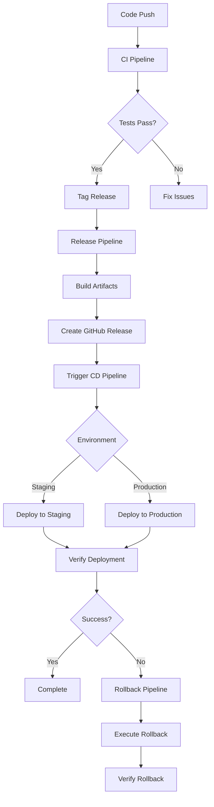

# GitHub Actions Workflows

This directory contains the CI/CD pipeline workflows for String_Multitool, designed with enterprise-grade practices focusing on extensibility, maintainability, and readability.

## Workflow Overview

### 🔄 Continuous Integration (`ci.yml`)
**Trigger**: Push to any branch, Pull Requests to main/develop
**Purpose**: Comprehensive code quality and testing pipeline

**Jobs:**
1. **Code Quality Analysis** - Linting, formatting, security scans
2. **Test Suite** - Multi-version Python testing with coverage
3. **Integration Tests** - End-to-end functionality validation
4. **Build Validation** - Verify build process integrity
5. **Security Scan** - Vulnerability assessment
6. **Documentation Check** - Validate documentation completeness

**Features:**
- Matrix testing across Python 3.8-3.12
- Code quality gates with configurable thresholds
- Comprehensive test coverage reporting
- Security vulnerability scanning
- Parallel job execution for efficiency

### 🚀 Build and Release (`release.yml`)
**Trigger**: Git tags (v*), Manual dispatch
**Purpose**: Production-ready build and GitHub release creation

**Jobs:**
1. **Pre-release Validation** - Version validation and changelog verification
2. **Build Matrix** - Multi-platform executable creation
3. **Create Release** - GitHub release with assets and checksums
4. **Post-release Tasks** - Cleanup and notification

**Features:**
- Automated version extraction and validation
- Build artifact verification and testing
- Checksum generation for security
- Release notes generation from changelog
- Support for pre-releases and drafts

### 📦 Continuous Deployment (`cd.yml`)
**Trigger**: Main branch pushes, Successful releases, Manual dispatch
**Purpose**: Automated deployment to staging/production environments

**Jobs:**
1. **Prepare Deployment** - Environment determination and validation
2. **Build for Deployment** - Environment-specific builds
3. **Post-deployment Verification** - Smoke tests and validation
4. **Prepare Rollback** - Rollback plan creation

**Features:**
- Environment-specific configurations
- Deployment verification and smoke testing
- Automatic rollback plan generation
- Comprehensive deployment logging

### 🔙 Emergency Rollback (`rollback.yml`)
**Trigger**: Manual dispatch only
**Purpose**: Emergency rollback to previous stable version

**Jobs:**
1. **Validate Rollback** - Request validation and safety checks
2. **Create Backup** - Pre-rollback state backup
3. **Execute Rollback** - Rollback deployment execution
4. **Verify Rollback** - Post-rollback verification
5. **Notify and Cleanup** - Stakeholder notification and cleanup

**Features:**
- Multi-step validation with confirmation requirements
- Automatic backup creation before rollback
- Comprehensive rollback verification
- Incident reporting and notification

## Workflow Architecture



## Configuration

### Environment Variables
- `PYTHON_VERSION`: Default Python version (3.12)
- `COVERAGE_THRESHOLD`: Minimum code coverage percentage (80%)
- `BUILD_TIMEOUT`: Maximum build time in minutes (45)
- `ARTIFACT_RETENTION_DAYS`: Artifact retention period

### Secrets Required
- `GITHUB_TOKEN`: Automatically provided by GitHub Actions
- Additional secrets may be required for deployment targets

### Environments
- **staging**: Development/testing environment
- **production**: Live production environment

## Usage Examples

### Triggering a Release
```bash
# Create and push a version tag
git tag v2.2.0
git push origin v2.2.0
```

### Manual Deployment
```bash
# Use GitHub CLI to trigger deployment
gh workflow run cd.yml -f environment=staging

# Or use the GitHub web interface
# Actions → Continuous Deployment → Run workflow
```

### Emergency Rollback
```bash
# Use GitHub CLI for emergency rollback
gh workflow run rollback.yml \
  -f version=v2.1.0 \
  -f environment=production \
  -f reason="Critical bug in v2.2.0" \
  -f confirm=CONFIRM

# Or use the GitHub web interface with confirmation
```

## Monitoring and Observability

### Artifacts Generated
- **Test Results**: JUnit XML, coverage reports, HTML coverage
- **Build Artifacts**: Executable packages, checksums, metadata
- **Deployment Logs**: Deployment status, verification results
- **Rollback Plans**: Emergency rollback procedures and backups

### Notifications
- **Success/Failure**: Workflow status updates
- **Releases**: New version announcements
- **Deployments**: Environment deployment status
- **Rollbacks**: Emergency rollback notifications

## Best Practices

### Code Quality
- All code must pass linting and formatting checks
- Minimum 80% test coverage required
- Security scans must pass without high-severity issues
- Documentation must be complete and up-to-date

### Release Management
- Follow semantic versioning (SemVer)
- Include changelog entries for all releases
- Test releases in staging before production
- Maintain rollback plans for all production deployments

### Security
- All dependencies scanned for vulnerabilities
- Secrets managed through GitHub Secrets
- Deployment environments protected with required reviews
- Audit logs maintained for all deployments and rollbacks

## Troubleshooting

### Common Issues

**Build Failures**
- Check Python version compatibility
- Verify all dependencies are available
- Review build logs for specific errors

**Test Failures**
- Check test coverage requirements
- Verify test environment setup
- Review failing test details

**Deployment Issues**
- Verify environment configuration
- Check deployment target accessibility
- Review deployment logs and verification results

**Rollback Problems**
- Ensure target version exists and is valid
- Verify rollback confirmation was provided
- Check rollback plan execution logs

### Getting Help
- Review workflow run logs in GitHub Actions
- Check artifact downloads for detailed reports
- Use GitHub Discussions for community support
- Create issues for bug reports and feature requests

## Extending the Workflows

### Adding New Environments
1. Update environment lists in workflow files
2. Add environment-specific configurations
3. Update deployment logic for new targets
4. Test deployment and rollback procedures

### Adding New Build Targets
1. Extend build matrix in `release.yml`
2. Update artifact naming conventions
3. Add platform-specific build logic
4. Update verification procedures

### Integrating External Services
1. Add required secrets to repository settings
2. Update workflow files with service integration
3. Add verification steps for external dependencies
4. Update documentation with new requirements

## Maintenance

### Regular Tasks
- Review and update Python version matrix
- Update action versions to latest stable
- Review and adjust timeout values
- Clean up old artifacts and logs

### Security Updates
- Monitor for security advisories on used actions
- Update dependencies regularly
- Review and rotate secrets as needed
- Audit workflow permissions and access

### Performance Optimization
- Monitor workflow execution times
- Optimize caching strategies
- Review parallel job execution
- Adjust resource allocation as needed