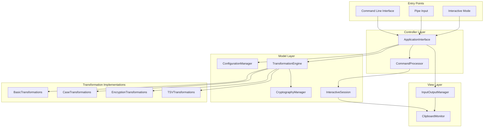
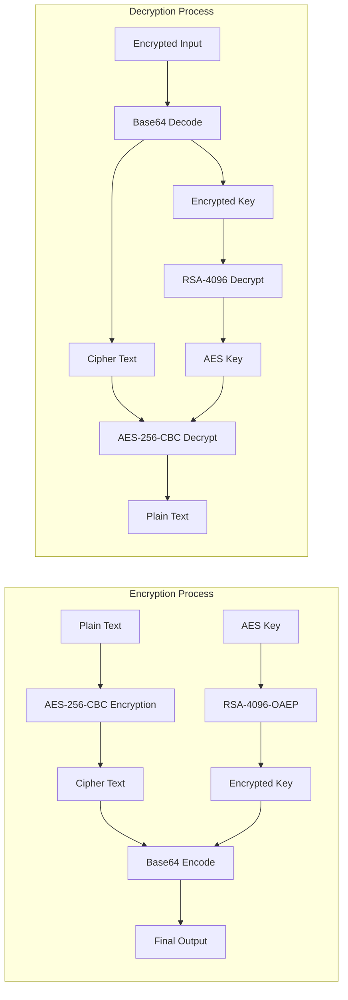
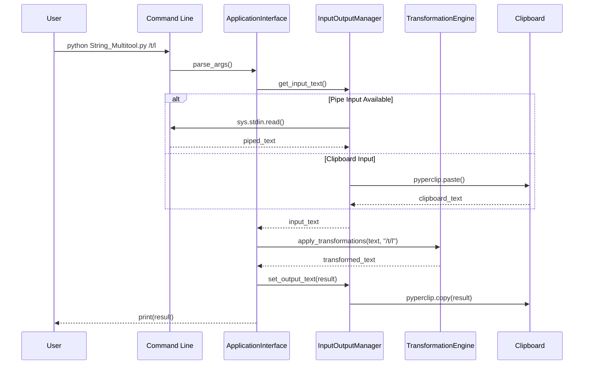
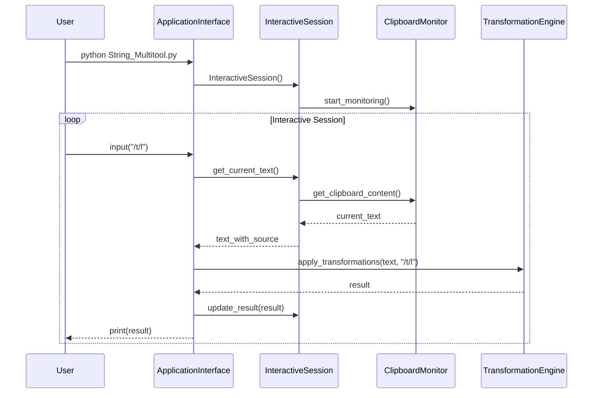

# String-Multitool Architecture Design

This document provides a comprehensive overview of String-Multitool's architecture, design patterns, and implementation decisions following modern software engineering best practices.

## Table of Contents

- [Architecture Overview](#architecture-overview)
- [MVC Design Pattern](#mvc-design-pattern)
- [Component Design](#component-design)
- [Security Architecture](#security-architecture)
- [Data Flow](#data-flow)
- [Extension Points](#extension-points)
- [Performance Considerations](#performance-considerations)
- [Design Decisions](#design-decisions)

## Architecture Overview

String-Multitool implements a modern MVC (Model-View-Controller) architecture optimized for command-line applications with both batch and interactive execution modes.

### High-Level System Architecture



## MVC Design Pattern

String-Multitool follows **Python MVC best practices** with clear separation of concerns optimized for CLI applications.

### Model Layer (`models/`)

**Responsibility**: Business logic, data processing, and domain rules

```python
models/
├── config.py              # Configuration management and validation
├── transformations.py      # Core transformation engine
├── crypto.py              # Cryptography operations
├── interactive.py         # Interactive session state management
├── types.py               # Type definitions and protocols
└── transformation_base.py  # Abstract base classes
```

**Key Characteristics**:
- No UI dependencies (no clipboard/stdio operations)
- Pure functions and classes with deterministic behavior
- Comprehensive error handling with context
- Protocol-based interfaces for loose coupling

### View/Controller Layer (`io/`)

**Responsibility**: User interface, input/output, and external communication

```python
io/
├── manager.py     # I/O operations serving as CLI interface
└── clipboard.py   # Clipboard monitoring and interaction
```

**Key Characteristics**:
- Handles all user interface operations
- Manages clipboard, file I/O, and stdio
- Protocol interfaces to communicate with model layer
- Cross-platform compatibility

### Entry Point (`main.py`)

**Responsibility**: Application flow control and component coordination

**Key Characteristics**:
- Command-line argument processing
- Component instantiation and dependency injection
- Top-level exception management
- Application lifecycle management

## Component Design

### Dependency Injection Pattern

String-Multitool uses constructor-based dependency injection for loose coupling:

```python
class ApplicationInterface:
    def __init__(
        self,
        config_manager: ConfigurationManager,
        transformation_engine: TextTransformationEngine,
        io_manager: InputOutputManager,
        crypto_manager: CryptographyManager | None = None,
    ):
        # Dependencies injected at construction time
        self.config_manager = config_manager
        self.transformation_engine = transformation_engine
        # ...
```

### Protocol-Based Design

Interfaces defined using Python protocols for maximum flexibility:

```python
class TransformationEngineProtocol(Protocol):
    def apply_transformations(self, text: str, rules: str) -> str: ...
    def get_available_rules(self) -> dict[str, TransformationRule]: ...

class ConfigManagerProtocol(Protocol):
    def get_config(self, key: str, default: Any = None) -> Any: ...
```

### Configuration-Driven Architecture

External JSON configuration enables runtime customization without code changes:

```json
{
  "basic_transformations": {
    "t": {"description": "Trim whitespace", "example": "/t"},
    "l": {"description": "Convert to lowercase", "example": "/l"}
  },
  "case_transformations": {
    "p": {"description": "Convert to PascalCase", "example": "/p"}
  }
}
```

## Security Architecture

### Hybrid Encryption System

String-Multitool implements military-grade security using RSA-4096 + AES-256 hybrid encryption:



### Key Management

- **RSA Key Pair**: Auto-generated 4096-bit keys stored in `rsa/` directory
- **File Permissions**: Private keys secured with `0o600` permissions
- **Key Rotation**: Manual key regeneration supported
- **No Key Escrow**: Keys remain local to user's system

### Security Configuration

```json
{
  "rsa_encryption": {
    "key_size": 4096,
    "padding": "OAEP",
    "hash_algorithm": "SHA256",
    "key_directory": "rsa",
    "private_key_file": "private_key.pem",
    "public_key_file": "public_key.pem"
  }
}
```

## Data Flow

### Command Mode Data Flow



### Interactive Mode Data Flow



## Extension Points

### Adding New Transformation Rules

1. **Rule Definition** (`config/transformation_rules.json`):
```json
{
  "custom_rules": {
    "my_rule": {
      "description": "My custom transformation",
      "example": "/my_rule",
      "category": "custom"
    }
  }
}
```

2. **Implementation**:
```python
def my_custom_transformation(self, text: str) -> str:
    """Implement custom transformation logic."""
    # Custom logic here
    return processed_text
```

3. **Registration**:
```python
def _initialize_rules(self):
    # Existing rules...
    self._register_rule("my_rule", self.my_custom_transformation)
```

### Plugin Architecture Considerations

Future plugin system could leverage:
- **Entry Points**: `setuptools` entry points for rule discovery
- **Module Loading**: Dynamic import of rule modules
- **Configuration Merge**: Combining rule definitions from multiple sources

## Performance Considerations

### Configuration Caching

```python
class ConfigurationManager:
    def __init__(self):
        self._transformation_rules: dict[str, Any] | None = None
        
    def load_transformation_rules(self) -> dict[str, Any]:
        if self._transformation_rules is None:
            # Load and cache configuration
            self._transformation_rules = self._load_json_file(config_file)
        return self._transformation_rules
```

### Memory Efficiency

- **Lazy Loading**: Configuration loaded only when needed
- **String Processing**: In-place operations where possible
- **Resource Cleanup**: Proper cleanup in interactive mode

### Clipboard Monitoring Optimization

```python
class ClipboardMonitor:
    def __init__(self, polling_interval: float = 1.0):
        self.polling_interval = polling_interval
        self._last_content_hash = None
    
    def has_clipboard_changed(self) -> bool:
        current_hash = hashlib.md5(content.encode()).hexdigest()
        if current_hash != self._last_content_hash:
            self._last_content_hash = current_hash
            return True
        return False
```

## Design Decisions

### Why MVC for CLI Applications?

**Decision**: Implement MVC pattern for a command-line tool

**Rationale**:
- **Separation of Concerns**: Clear boundaries between business logic, UI, and control flow
- **Testability**: Models can be tested independently of I/O operations
- **Maintainability**: Changes to one layer don't affect others
- **Extensibility**: New interfaces (GUI, web) can reuse model layer

**Trade-offs**: Slightly more complex structure for simple operations, but significant benefits for long-term maintenance

### Why Hybrid Encryption?

**Decision**: RSA-4096 + AES-256 hybrid instead of RSA-only

**Rationale**:
- **Performance**: AES encryption is orders of magnitude faster for large data
- **Security**: RSA-4096 provides excellent key exchange security
- **Scalability**: No size limitations (RSA has ~500 byte limit)
- **Standard Practice**: Industry-standard approach for secure applications

**Trade-offs**: More complex implementation, but essential for practical security

### Why JSON Configuration?

**Decision**: JSON files for configuration instead of YAML or TOML

**Rationale**:
- **Python Native**: Built-in `json` module, no additional dependencies
- **Simplicity**: Easy to parse and generate programmatically
- **Validation**: Simple schema validation possible
- **IDE Support**: Universal IDE support for JSON editing

**Trade-offs**: Less human-friendly than YAML, but acceptable for the use case

### Why Protocol-Based Interfaces?

**Decision**: Use Python protocols instead of abstract base classes

**Rationale**:
- **Structural Subtyping**: Duck typing with type checking benefits
- **Flexibility**: No inheritance hierarchy required
- **Modern Python**: Follows current best practices (PEP 544)
- **Testing**: Easy to create mock objects for testing

**Trade-offs**: Requires Python 3.8+, but project targets 3.12+

## Quality Attributes

### Maintainability

- **Clear Architecture**: Well-defined component boundaries
- **Documentation**: Comprehensive inline and external documentation
- **Type Safety**: Full type hints with mypy validation
- **Testing**: Comprehensive test coverage with modern pytest patterns

### Extensibility

- **Configuration-Driven**: New rules via JSON without code changes
- **Plugin-Ready**: Architecture prepared for future plugin system
- **Protocol-Based**: Easy to swap implementations
- **Modular Design**: Independent components with clear interfaces

### Security

- **Defense in Depth**: Multiple layers of input validation
- **Secure Defaults**: Safe configuration settings by default
- **Principle of Least Privilege**: Minimal required permissions
- **Cryptographic Standards**: Industry-standard algorithms and practices

### Performance

- **Efficient Algorithms**: Optimized text processing algorithms
- **Caching**: Intelligent caching of configuration and computed values
- **Resource Management**: Proper cleanup and resource management
- **Scalability**: Handles large text files efficiently

---

*This architecture document reflects the current implementation and serves as a guide for future development. It should be updated as the system evolves.*