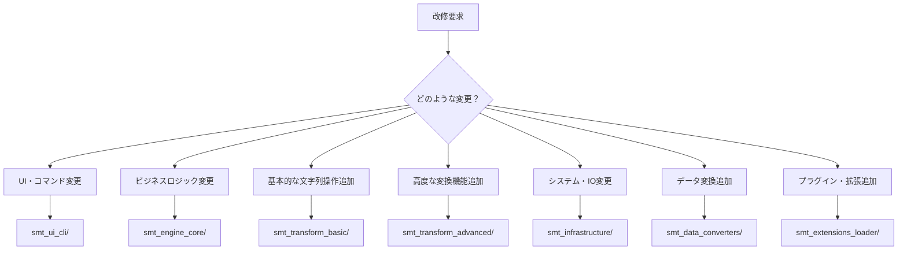

# プロジェクト改修判断ガイド

## 🎯 改修時の判断フローチャート



## 📋 プロジェクト別改修判断基準

### 🖥️ smt_ui_cli/ - Command Line Interface
**改修するケース:**
- コマンドライン引数の追加・変更
- 出力フォーマットの変更
- インタラクティブシェルの機能追加
- ヘルプメッセージの改善
- エラー表示の改善

**改修しないケース:**
- ビジネスロジックの変更 → `smt_engine_core/`
- 変換処理の追加 → `smt_transform_*`

**例:**
```bash
# ✅ smt_ui_cli/ での改修
- 新しいコマンドオプション追加: --verbose, --output-format
- インタラクティブモードの改善
- 結果表示の色付け対応

# ❌ smt_ui_cli/ でしない改修
- 新しい変換ルールの追加
- 暗号化アルゴリズムの変更
```

### ⚙️ smt_engine_core/ - Core Business Logic
**改修するケース:**
- ビジネスルールの変更
- ドメインエンティティの追加・修正
- ユースケースの追加・変更
- バリデーションロジックの変更
- ドメインイベントの追加

**改修しないケース:**
- UI表示の変更 → `smt_ui_*`
- 具体的な変換処理 → `smt_transform_*`
- IOやストレージ → `smt_infrastructure/`

**例:**
```python
# ✅ smt_engine_core/ での改修
- テキストエンティティのバリデーション強化
- 変換ルール適用順序のビジネスロジック変更
- セッション管理のドメインルール追加

# ❌ smt_engine_core/ でしない改修
- 具体的なハッシュアルゴリズム実装
- クリップボードアクセス実装
```

### 📝 smt_transform_basic/ - Basic Text Operations
**改修するケース:**
- 基本的な文字列操作の追加（trim, case変換など）
- 全ユーザーが使用する汎用的な変換
- パフォーマンスが重要な基本変換
- 依存関係のない軽量な処理

**改修しないケース:**
- 暗号化・ハッシュ化 → `smt_transform_advanced/`
- 特殊文字エンコーディング → `smt_transform_advanced/`
- データフォーマット変換 → `smt_data_converters/`

**例:**
```python
# ✅ smt_transform_basic/ での改修
- 新しいケース変換（snake_case, kebab-case）
- 空白文字の正規化オプション追加
- 基本的な文字列置換パターン

# ❌ smt_transform_basic/ でしない改修
- Base64エンコーディング
- JSON整形
```

### 🚀 smt_transform_advanced/ - Advanced Transformations
**改修するケース:**
- 暗号化・復号化機能
- ハッシュ化・デジタル署名
- 複雑な文字エンコーディング
- AI機能統合
- 日本語特有の変換
- 高度なアルゴリズム

**改修しないケース:**
- 基本的な文字列操作 → `smt_transform_basic/`
- データフォーマット変換 → `smt_data_converters/`

**例:**
```python
# ✅ smt_transform_advanced/ での改修
- 新しい暗号化アルゴリズム対応
- 日本語のひらがな・カタカナ変換
- AI による文章要約機能
- Unicode正規化の高度オプション

# ❌ smt_transform_advanced/ でしない改修
- 基本的な大文字小文字変換
- TSVファイル処理
```

### 🔧 smt_infrastructure/ - Technical Infrastructure
**改修するケース:**
- IO操作（ファイル、クリップボード、ネットワーク）
- 設定ファイル管理
- ログ出力機能
- キャッシュ機能
- セッション永続化
- 外部サービス連携

**改修しないケース:**
- ビジネスロジック → `smt_engine_core/`
- 変換処理 → `smt_transform_*`
- UI表示 → `smt_ui_*`

**例:**
```python
# ✅ smt_infrastructure/ での改修
- 新しい設定フォーマット対応（YAML, TOML）
- クラウドストレージ連携
- ログローテーション機能
- 設定の暗号化保存

# ❌ smt_infrastructure/ でしない改修
- 変換結果の表示形式変更
- 新しい変換アルゴリズム
```

### 📊 smt_data_converters/ - Data Format Converters
**改修するケース:**
- データフォーマット間の変換（TSV, CSV, JSON, XML）
- 構造化データの処理
- データバリデーション
- インポート・エクスポート機能

**改修しないケース:**
- 基本的な文字列操作 → `smt_transform_basic/`
- 暗号化処理 → `smt_transform_advanced/`

**例:**
```python
# ✅ smt_data_converters/ での改修
- 新しいCSV方言対応
- JSONスキーマバリデーション
- XML名前空間処理
- データベースエクスポート

# ❌ smt_data_converters/ でしない改修
- 文字列の大文字小文字変換
- テキストの暗号化
```

### 🔌 smt_extensions_loader/ - Extension System
**改修するケース:**
- プラグインシステムの改善
- 動的な機能追加・削除
- 拡張の依存関係管理
- サードパーティ拡張サポート

**改修しないケース:**
- 具体的な変換処理 → `smt_transform_*`
- UI機能 → `smt_ui_*`

**例:**
```python
# ✅ smt_extensions_loader/ での改修
- 拡張の自動更新機能
- 拡張の設定管理
- プラグインの依存関係解決
- 拡張のサンドボックス実行

# ❌ smt_extensions_loader/ でしない改修
- 具体的な変換実装
- UI表示処理
```

## 🤔 判断に迷った場合のチェックリスト

### 1. 責任の範囲を確認
- [ ] この変更はどの層の責任か？（UI / ビジネス / インフラ）
- [ ] 他の機能への影響範囲は？
- [ ] テストの容易性は保たれるか？

### 2. 依存関係を確認
- [ ] 新しい外部ライブラリが必要か？
- [ ] 既存の依存関係に影響するか？
- [ ] Clean Architectureの原則に従っているか？

### 3. 将来性を確認
- [ ] 似たような機能の追加予定は？
- [ ] この変更は拡張可能か？
- [ ] 保守性は向上するか？

## 📚 参考資料

- [Clean Architecture by Robert C. Martin](https://blog.cleancoder.com/uncle-bob/2012/08/13/the-clean-architecture.html)
- [Domain-Driven Design](https://martinfowler.com/bliki/DomainDrivenDesign.html)
- [Single Responsibility Principle](https://en.wikipedia.org/wiki/Single_responsibility_principle)

---

**重要:** 判断に迷った場合は、より内側の層（Core）から始めて、段階的に外側の層に影響を与える方針で進めることを推奨します。