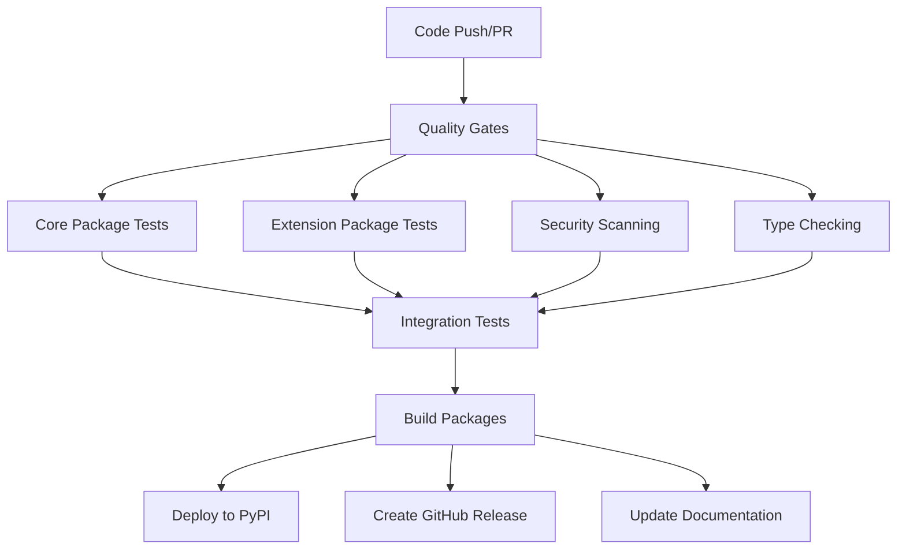

# Build and Deployment Documentation

Modern CI/CD pipeline documentation for String-Multitool's modular architecture with comprehensive testing and deployment automation.

## Overview

String-Multitool uses a modern CI/CD approach with GitHub Actions, following industry best practices for Python package management, testing, security scanning, and automated deployment.

## Architecture

### Pipeline Components



### Quality Gates

1. **Code Quality**
   - Format checking with Black
   - Import sorting with isort
   - Linting with ruff
   - Type checking with mypy (strict mode)

2. **Security**
   - Vulnerability scanning with bandit
   - Dependency audit with safety
   - Secret detection with GitHub Advanced Security

3. **Testing**
   - Unit tests with pytest
   - Integration tests
   - Performance benchmarks
   - Cross-platform compatibility (Windows, macOS, Linux)

## CI/CD Workflows

### Current Implementation

#### 1. Continuous Integration (`ci.yml`)

```yaml
name: CI

on:
  push:
    branches: [ main, develop ]
  pull_request:
    branches: [ main ]

jobs:
  quality-gates:
    runs-on: ubuntu-latest
    strategy:
      matrix:
        python-version: ['3.12', '3.13']

    steps:
    - uses: actions/checkout@v4

    - name: Set up Python
      uses: actions/setup-python@v4
      with:
        python-version: ${{ matrix.python-version }}

    - name: Install UV
      run: curl -LsSf https://astral.sh/uv/install.sh | sh

    - name: Install dependencies
      run: |
        uv sync --all-extras --dev

    - name: Code formatting check
      run: uv run black --check string_multitool_core/ string_multitool_extensions/

    - name: Import sorting check
      run: uv run isort --check-only string_multitool_core/ string_multitool_extensions/

    - name: Linting
      run: uv run ruff check string_multitool_core/ string_multitool_extensions/

    - name: Type checking
      run: |
        uv run mypy string_multitool_core/ --strict
        uv run mypy string_multitool_extensions/ --strict

    - name: Security scanning
      run: |
        uv run bandit -r string_multitool_core/ string_multitool_extensions/
        uv run safety check

  test-core:
    needs: quality-gates
    runs-on: ${{ matrix.os }}
    strategy:
      matrix:
        os: [ubuntu-latest, windows-latest, macos-latest]
        python-version: ['3.12', '3.13']

    steps:
    - uses: actions/checkout@v4

    - name: Set up Python
      uses: actions/setup-python@v4
      with:
        python-version: ${{ matrix.python-version }}

    - name: Install UV
      run: curl -LsSf https://astral.sh/uv/install.sh | sh

    - name: Test Core Package
      run: |
        cd string_multitool_core
        uv sync --dev
        uv run pytest tests/ -v --cov=string_multitool_core --cov-report=xml

    - name: Upload Core Coverage
      uses: codecov/codecov-action@v3
      with:
        file: ./string_multitool_core/coverage.xml
        flags: core
        name: core-${{ matrix.os }}-${{ matrix.python-version }}

  test-extensions:
    needs: quality-gates
    runs-on: ${{ matrix.os }}
    strategy:
      matrix:
        os: [ubuntu-latest, windows-latest, macos-latest]
        python-version: ['3.12', '3.13']

    steps:
    - uses: actions/checkout@v4

    - name: Set up Python
      uses: actions/setup-python@v4
      with:
        python-version: ${{ matrix.python-version }}

    - name: Install UV
      run: curl -LsSf https://astral.sh/uv/install.sh | sh

    - name: Test Extensions Package
      run: |
        cd string_multitool_extensions
        uv sync --dev
        uv run pytest tests/ -v --cov=string_multitool_extensions --cov-report=xml

    - name: Upload Extensions Coverage
      uses: codecov/codecov-action@v3
      with:
        file: ./string_multitool_extensions/coverage.xml
        flags: extensions
        name: extensions-${{ matrix.os }}-${{ matrix.python-version }}

  integration-tests:
    needs: [test-core, test-extensions]
    runs-on: ubuntu-latest

    steps:
    - uses: actions/checkout@v4

    - name: Set up Python
      uses: actions/setup-python@v4
      with:
        python-version: '3.12'

    - name: Install UV
      run: curl -LsSf https://astral.sh/uv/install.sh | sh

    - name: Integration Tests
      run: |
        uv sync --all-extras --dev
        uv run pytest tests/integration/ -v --maxfail=1

    - name: Performance Tests
      run: |
        uv run pytest tests/performance/ -v -m performance
```

#### 2. Continuous Deployment (`cd.yml`)

```yaml
name: CD

on:
  push:
    tags:
      - 'v*.*.*'

jobs:
  build-and-deploy:
    runs-on: ubuntu-latest
    environment: production

    steps:
    - uses: actions/checkout@v4

    - name: Set up Python
      uses: actions/setup-python@v4
      with:
        python-version: '3.12'

    - name: Install UV
      run: curl -LsSf https://astral.sh/uv/install.sh | sh

    - name: Build Core Package
      run: |
        cd string_multitool_core
        uv sync --dev
        uv build

    - name: Build Extensions Package
      run: |
        cd string_multitool_extensions
        uv sync --dev
        uv build

    - name: Test Built Packages
      run: |
        # Install and test built packages
        pip install string_multitool_core/dist/*.whl
        pip install string_multitool_extensions/dist/*.whl
        python -c "from string_multitool_core import CoreTransformationEngine; print('Core OK')"
        python -c "from string_multitool_extensions import ApplicationInterface; print('Extensions OK')"

    - name: Publish Core to PyPI
      env:
        TWINE_USERNAME: __token__
        TWINE_PASSWORD: ${{ secrets.PYPI_API_TOKEN_CORE }}
      run: |
        uv run twine upload string_multitool_core/dist/*

    - name: Publish Extensions to PyPI
      env:
        TWINE_USERNAME: __token__
        TWINE_PASSWORD: ${{ secrets.PYPI_API_TOKEN_EXTENSIONS }}
      run: |
        uv run twine upload string_multitool_extensions/dist/*

    - name: Create GitHub Release
      uses: softprops/action-gh-release@v1
      with:
        files: |
          string_multitool_core/dist/*
          string_multitool_extensions/dist/*
        generate_release_notes: true
      env:
        GITHUB_TOKEN: ${{ secrets.GITHUB_TOKEN }}

  update-documentation:
    needs: build-and-deploy
    runs-on: ubuntu-latest

    steps:
    - uses: actions/checkout@v4

    - name: Set up Python
      uses: actions/setup-python@v4
      with:
        python-version: '3.12'

    - name: Install UV
      run: curl -LsSf https://astral.sh/uv/install.sh | sh

    - name: Build Documentation
      run: |
        uv sync --all-extras --dev
        cd docs
        uv run sphinx-build -b html . _build/html

    - name: Deploy to GitHub Pages
      uses: peaceiris/actions-gh-pages@v3
      with:
        github_token: ${{ secrets.GITHUB_TOKEN }}
        publish_dir: ./docs/_build/html
```

#### 3. Security Scanning (`security.yml`)

```yaml
name: Security

on:
  schedule:
    - cron: '0 6 * * 1'  # Weekly on Monday
  push:
    branches: [ main ]

jobs:
  security-scan:
    runs-on: ubuntu-latest

    steps:
    - uses: actions/checkout@v4

    - name: Set up Python
      uses: actions/setup-python@v4
      with:
        python-version: '3.12'

    - name: Install UV
      run: curl -LsSf https://astral.sh/uv/install.sh | sh

    - name: Security Scanning
      run: |
        uv sync --all-extras --dev
        uv run bandit -r string_multitool_core/ string_multitool_extensions/ -f json -o bandit-report.json
        uv run safety check --json --output safety-report.json
        uv run pip-audit --format=json --output=pip-audit-report.json

    - name: Upload Security Reports
      uses: actions/upload-artifact@v4
      with:
        name: security-reports
        path: |
          bandit-report.json
          safety-report.json
          pip-audit-report.json

  dependency-review:
    runs-on: ubuntu-latest
    if: github.event_name == 'pull_request'

    steps:
    - uses: actions/checkout@v4
    - uses: actions/dependency-review-action@v3
      with:
        fail-on-severity: moderate
```

### Enhanced Workflows (Recommended)

#### 1. Modern Testing Workflow

```yaml
name: Modern CI

on:
  push:
    branches: [ main, develop ]
  pull_request:
    branches: [ main ]

env:
  UV_CACHE_DIR: ~/.cache/uv

jobs:
  quality-matrix:
    runs-on: ${{ matrix.os }}
    strategy:
      fail-fast: false
      matrix:
        os: [ubuntu-latest, windows-latest, macos-latest]
        python-version: ['3.12', '3.13']
        include:
          - os: ubuntu-latest
            python-version: '3.12'
            coverage: true

    steps:
    - uses: actions/checkout@v4
      with:
        fetch-depth: 0

    - name: Set up Python ${{ matrix.python-version }}
      uses: actions/setup-python@v4
      with:
        python-version: ${{ matrix.python-version }}

    - name: Cache UV
      uses: actions/cache@v3
      with:
        path: ${{ env.UV_CACHE_DIR }}
        key: uv-${{ matrix.os }}-${{ matrix.python-version }}-${{ hashFiles('**/uv.lock') }}
        restore-keys: |
          uv-${{ matrix.os }}-${{ matrix.python-version }}-

    - name: Install UV
      run: curl -LsSf https://astral.sh/uv/install.sh | sh

    - name: Validate Project Structure
      run: |
        # Verify modular structure
        test -d string_multitool_core
        test -d string_multitool_extensions
        test -f string_multitool_core/pyproject.toml
        test -f string_multitool_extensions/pyproject.toml

    - name: Install Dependencies
      run: |
        # Install both packages with all extras
        cd string_multitool_core && uv sync --all-extras --dev
        cd ../string_multitool_extensions && uv sync --all-extras --dev

    - name: Code Quality Checks
      run: |
        # Format check
        uv run black --check --diff string_multitool_core/ string_multitool_extensions/

        # Import sorting
        uv run isort --check-only --diff string_multitool_core/ string_multitool_extensions/

        # Linting
        uv run ruff check string_multitool_core/ string_multitool_extensions/ --format=github

        # Type checking with strict mode
        uv run mypy string_multitool_core/ --strict --show-error-codes
        uv run mypy string_multitool_extensions/ --strict --show-error-codes

    - name: Security Scanning
      run: |
        # Vulnerability scanning
        uv run bandit -r string_multitool_core/ string_multitool_extensions/ --severity-level medium

        # Dependency audit
        uv run safety check --json --output safety-report.json || true
        uv run pip-audit --format=json --output pip-audit-report.json || true

    - name: Test Core Package
      run: |
        cd string_multitool_core
        if [ "${{ matrix.coverage }}" = "true" ]; then
          uv run pytest tests/ -v --cov=string_multitool_core --cov-report=xml --cov-report=html --benchmark-skip
        else
          uv run pytest tests/ -v --benchmark-skip
        fi

    - name: Test Extensions Package
      run: |
        cd string_multitool_extensions
        if [ "${{ matrix.coverage }}" = "true" ]; then
          uv run pytest tests/ -v --cov=string_multitool_extensions --cov-report=xml --cov-report=html --benchmark-skip
        else
          uv run pytest tests/ -v --benchmark-skip
        fi

    - name: Integration Tests
      run: |
        # Test core + extensions integration
        uv run pytest tests/integration/ -v --maxfail=3

    - name: Performance Benchmarks
      if: matrix.os == 'ubuntu-latest' && matrix.python-version == '3.12'
      run: |
        uv run pytest tests/performance/ -v -m performance --benchmark-only --benchmark-json=benchmark.json

    - name: Upload Coverage to Codecov
      if: matrix.coverage
      uses: codecov/codecov-action@v3
      with:
        files: ./string_multitool_core/coverage.xml,./string_multitool_extensions/coverage.xml
        flags: ${{ matrix.os }}-${{ matrix.python-version }}
        name: coverage-${{ matrix.os }}-${{ matrix.python-version }}

    - name: Upload Test Reports
      if: always()
      uses: actions/upload-artifact@v4
      with:
        name: test-reports-${{ matrix.os }}-${{ matrix.python-version }}
        path: |
          string_multitool_core/htmlcov/
          string_multitool_extensions/htmlcov/
          benchmark.json
          safety-report.json
          pip-audit-report.json
```

#### 2. Advanced Deployment Pipeline

```yaml
name: Advanced CD

on:
  push:
    tags:
      - 'v*.*.*'
  workflow_dispatch:
    inputs:
      deploy_target:
        description: 'Deployment target'
        required: true
        default: 'staging'
        type: choice
        options:
        - staging
        - production

env:
  UV_CACHE_DIR: ~/.cache/uv

jobs:
  validate-release:
    runs-on: ubuntu-latest
    outputs:
      version: ${{ steps.version.outputs.version }}
      is_prerelease: ${{ steps.version.outputs.is_prerelease }}

    steps:
    - uses: actions/checkout@v4

    - name: Extract Version
      id: version
      run: |
        VERSION=${GITHUB_REF#refs/tags/v}
        echo "version=$VERSION" >> $GITHUB_OUTPUT
        if [[ "$VERSION" =~ (alpha|beta|rc) ]]; then
          echo "is_prerelease=true" >> $GITHUB_OUTPUT
        else
          echo "is_prerelease=false" >> $GITHUB_OUTPUT
        fi

    - name: Validate Version Consistency
      run: |
        VERSION="${{ steps.version.outputs.version }}"
        CORE_VERSION=$(grep version string_multitool_core/pyproject.toml | head -n1 | cut -d'"' -f2)
        EXT_VERSION=$(grep version string_multitool_extensions/pyproject.toml | head -n1 | cut -d'"' -f2)

        if [ "$VERSION" != "$CORE_VERSION" ] || [ "$VERSION" != "$EXT_VERSION" ]; then
          echo "Version mismatch: Tag=$VERSION, Core=$CORE_VERSION, Ext=$EXT_VERSION"
          exit 1
        fi

  build-packages:
    needs: validate-release
    runs-on: ${{ matrix.os }}
    strategy:
      matrix:
        os: [ubuntu-latest, windows-latest, macos-latest]

    steps:
    - uses: actions/checkout@v4

    - name: Set up Python
      uses: actions/setup-python@v4
      with:
        python-version: '3.12'

    - name: Cache UV
      uses: actions/cache@v3
      with:
        path: ${{ env.UV_CACHE_DIR }}
        key: uv-${{ matrix.os }}-build-${{ hashFiles('**/uv.lock') }}

    - name: Install UV
      run: curl -LsSf https://astral.sh/uv/install.sh | sh

    - name: Build Core Package
      run: |
        cd string_multitool_core
        uv sync --dev
        uv build --wheel --sdist

    - name: Build Extensions Package
      run: |
        cd string_multitool_extensions
        uv sync --dev
        uv build --wheel --sdist

    - name: Test Package Installation
      run: |
        # Create test environment
        uv venv test-env
        source test-env/bin/activate || test-env\Scripts\activate

        # Test wheel installation
        pip install string_multitool_core/dist/*.whl
        pip install string_multitool_extensions/dist/*.whl

        # Smoke tests
        python -c "
        from string_multitool_core import CoreTransformationEngine
        engine = CoreTransformationEngine()
        result = engine.transform('  test  ', '/t/l')
        assert result.success
        assert result.text == 'test'
        print('Core package: OK')
        "

        python -c "
        from string_multitool_extensions import ApplicationInterface
        from string_multitool_extensions.loader import ExtensionTransformationLoader
        loader = ExtensionTransformationLoader()
        func = loader.load_transformation('sha256')
        result = func('test')
        assert len(result) == 64
        print('Extensions package: OK')
        "

    - name: Upload Build Artifacts
      uses: actions/upload-artifact@v4
      with:
        name: packages-${{ matrix.os }}
        path: |
          string_multitool_core/dist/
          string_multitool_extensions/dist/

  security-validation:
    needs: build-packages
    runs-on: ubuntu-latest

    steps:
    - uses: actions/checkout@v4

    - name: Download Build Artifacts
      uses: actions/download-artifact@v4
      with:
        name: packages-ubuntu-latest

    - name: Security Scan Built Packages
      run: |
        # Install and scan built packages
        pip install string_multitool_core/dist/*.whl
        pip install string_multitool_extensions/dist/*.whl

        # Run security scans on installed packages
        bandit -r $(python -c "import string_multitool_core; print(string_multitool_core.__file__.replace('__init__.py', ''))")
        bandit -r $(python -c "import string_multitool_extensions; print(string_multitool_extensions.__file__.replace('__init__.py', ''))")

  deploy-staging:
    if: needs.validate-release.outputs.is_prerelease == 'true' || github.event.inputs.deploy_target == 'staging'
    needs: [validate-release, build-packages, security-validation]
    runs-on: ubuntu-latest
    environment: staging

    steps:
    - name: Download Build Artifacts
      uses: actions/download-artifact@v4
      with:
        name: packages-ubuntu-latest

    - name: Deploy to Test PyPI
      env:
        TWINE_USERNAME: __token__
        TWINE_PASSWORD: ${{ secrets.TEST_PYPI_API_TOKEN }}
        TWINE_REPOSITORY_URL: https://test.pypi.org/legacy/
      run: |
        pip install twine
        twine upload string_multitool_core/dist/* string_multitool_extensions/dist/*

  deploy-production:
    if: needs.validate-release.outputs.is_prerelease == 'false' && github.event.inputs.deploy_target != 'staging'
    needs: [validate-release, build-packages, security-validation]
    runs-on: ubuntu-latest
    environment: production

    steps:
    - uses: actions/checkout@v4

    - name: Download Build Artifacts
      uses: actions/download-artifact@v4
      with:
        name: packages-ubuntu-latest

    - name: Deploy to PyPI
      env:
        TWINE_USERNAME: __token__
        TWINE_PASSWORD: ${{ secrets.PYPI_API_TOKEN }}
      run: |
        pip install twine
        twine upload string_multitool_core/dist/* string_multitool_extensions/dist/*

    - name: Create GitHub Release
      uses: softprops/action-gh-release@v1
      with:
        files: |
          string_multitool_core/dist/*
          string_multitool_extensions/dist/*
        generate_release_notes: true
        prerelease: ${{ needs.validate-release.outputs.is_prerelease }}
        tag_name: v${{ needs.validate-release.outputs.version }}
      env:
        GITHUB_TOKEN: ${{ secrets.GITHUB_TOKEN }}

  update-docs:
    needs: deploy-production
    if: needs.validate-release.outputs.is_prerelease == 'false'
    runs-on: ubuntu-latest

    steps:
    - uses: actions/checkout@v4

    - name: Set up Python
      uses: actions/setup-python@v4
      with:
        python-version: '3.12'

    - name: Install UV
      run: curl -LsSf https://astral.sh/uv/install.sh | sh

    - name: Build Documentation
      run: |
        uv sync --all-extras --dev
        cd docs
        uv run sphinx-build -b html . _build/html
        touch _build/html/.nojekyll

    - name: Deploy Documentation
      uses: peaceiris/actions-gh-pages@v3
      with:
        github_token: ${{ secrets.GITHUB_TOKEN }}
        publish_dir: ./docs/_build/html
        cname: string-multitool.dev  # Custom domain if available

  notify-release:
    needs: [deploy-production, update-docs]
    runs-on: ubuntu-latest

    steps:
    - name: Notify Slack
      uses: slackapi/slack-github-action@v1
      with:
        payload: |
          {
            "text": "🚀 String-Multitool v${{ needs.validate-release.outputs.version }} released!",
            "blocks": [
              {
                "type": "section",
                "text": {
                  "type": "mrkdwn",
                  "text": "*String-Multitool v${{ needs.validate-release.outputs.version }}* has been successfully deployed!\n\n:package: Available on PyPI\n:memo: Documentation updated\n:octocat: GitHub release created"
                }
              }
            ]
          }
      env:
        SLACK_WEBHOOK_URL: ${{ secrets.SLACK_WEBHOOK_URL }}
```

## Build Tools and Scripts

### 1. Enhanced Build Script (`build.py`)

```python
#!/usr/bin/env python3
"""
Modern build script for String-Multitool modular packages.
Supports both core and extensions packages with comprehensive validation.
"""

import argparse
import subprocess
import sys
from pathlib import Path
from typing import List, Optional
import json
import time

class ModularBuilder:
    """Builder for modular String-Multitool packages."""

    def __init__(self, root_dir: Path = None):
        self.root_dir = root_dir or Path.cwd()
        self.core_dir = self.root_dir / "string_multitool_core"
        self.ext_dir = self.root_dir / "string_multitool_extensions"

    def validate_structure(self) -> bool:
        """Validate project structure."""
        required_files = [
            self.core_dir / "pyproject.toml",
            self.ext_dir / "pyproject.toml",
            self.core_dir / "string_multitool_core" / "__init__.py",
            self.ext_dir / "string_multitool_extensions" / "__init__.py",
        ]

        missing_files = [f for f in required_files if not f.exists()]
        if missing_files:
            print(f"❌ Missing required files: {missing_files}")
            return False

        print("✅ Project structure validated")
        return True

    def run_command(self, cmd: List[str], cwd: Path = None) -> bool:
        """Run command and return success status."""
        try:
            result = subprocess.run(
                cmd,
                cwd=cwd or self.root_dir,
                check=True,
                capture_output=True,
                text=True
            )
            return True
        except subprocess.CalledProcessError as e:
            print(f"❌ Command failed: {' '.join(cmd)}")
            print(f"Error: {e.stderr}")
            return False

    def install_dependencies(self) -> bool:
        """Install dependencies for both packages."""
        print("📦 Installing dependencies...")

        # Install core dependencies
        if not self.run_command(["uv", "sync", "--all-extras", "--dev"], self.core_dir):
            return False

        # Install extensions dependencies
        if not self.run_command(["uv", "sync", "--all-extras", "--dev"], self.ext_dir):
            return False

        print("✅ Dependencies installed")
        return True

    def run_quality_checks(self) -> bool:
        """Run code quality checks."""
        print("🔍 Running quality checks...")

        checks = [
            (["uv", "run", "black", "--check", "string_multitool_core/", "string_multitool_extensions/"], "Format check"),
            (["uv", "run", "isort", "--check-only", "string_multitool_core/", "string_multitool_extensions/"], "Import sorting"),
            (["uv", "run", "ruff", "check", "string_multitool_core/", "string_multitool_extensions/"], "Linting"),
            (["uv", "run", "mypy", "string_multitool_core/", "--strict"], "Core type checking"),
            (["uv", "run", "mypy", "string_multitool_extensions/", "--strict"], "Extensions type checking"),
        ]

        for cmd, description in checks:
            print(f"  • {description}...")
            if not self.run_command(cmd):
                return False

        print("✅ Quality checks passed")
        return True

    def run_security_scan(self) -> bool:
        """Run security scans."""
        print("🔒 Running security scans...")

        security_checks = [
            (["uv", "run", "bandit", "-r", "string_multitool_core/", "string_multitool_extensions/"], "Vulnerability scan"),
            (["uv", "run", "safety", "check"], "Dependency safety"),
        ]

        for cmd, description in security_checks:
            print(f"  • {description}...")
            if not self.run_command(cmd):
                print(f"⚠️  {description} failed, continuing...")

        print("✅ Security scans completed")
        return True

    def run_tests(self) -> bool:
        """Run test suites for both packages."""
        print("🧪 Running tests...")

        # Test core package
        print("  • Testing core package...")
        if not self.run_command(
            ["uv", "run", "pytest", "tests/", "-v", "--cov=string_multitool_core"],
            self.core_dir
        ):
            return False

        # Test extensions package
        print("  • Testing extensions package...")
        if not self.run_command(
            ["uv", "run", "pytest", "tests/", "-v", "--cov=string_multitool_extensions"],
            self.ext_dir
        ):
            return False

        # Integration tests
        print("  • Running integration tests...")
        if not self.run_command(["uv", "run", "pytest", "tests/integration/", "-v"]):
            print("⚠️  Integration tests failed, continuing...")

        print("✅ Tests completed")
        return True

    def build_packages(self) -> bool:
        """Build both packages."""
        print("🏗️  Building packages...")

        # Build core package
        print("  • Building core package...")
        if not self.run_command(["uv", "build"], self.core_dir):
            return False

        # Build extensions package
        print("  • Building extensions package...")
        if not self.run_command(["uv", "build"], self.ext_dir):
            return False

        print("✅ Packages built successfully")
        return True

    def validate_build(self) -> bool:
        """Validate built packages."""
        print("✅ Validating built packages...")

        # Check wheel files exist
        core_wheels = list((self.core_dir / "dist").glob("*.whl"))
        ext_wheels = list((self.ext_dir / "dist").glob("*.whl"))

        if not core_wheels:
            print("❌ Core package wheel not found")
            return False

        if not ext_wheels:
            print("❌ Extensions package wheel not found")
            return False

        # Test installation
        test_env = self.root_dir / ".test-env"
        if test_env.exists():
            self.run_command(["rm", "-rf", str(test_env)])

        # Create test environment and install packages
        if not self.run_command(["uv", "venv", str(test_env)]):
            return False

        # Determine activation script based on platform
        if sys.platform == "win32":
            activate_script = test_env / "Scripts" / "activate"
            pip_cmd = str(test_env / "Scripts" / "pip")
        else:
            activate_script = test_env / "bin" / "activate"
            pip_cmd = str(test_env / "bin" / "pip")

        # Install built packages
        core_wheel = str(core_wheels[0])
        ext_wheel = str(ext_wheels[0])

        if not self.run_command([pip_cmd, "install", core_wheel]):
            return False

        if not self.run_command([pip_cmd, "install", ext_wheel]):
            return False

        # Smoke test
        python_cmd = str(test_env / ("Scripts/python" if sys.platform == "win32" else "bin/python"))
        test_script = """
from string_multitool_core import CoreTransformationEngine
from string_multitool_extensions.loader import ExtensionTransformationLoader

# Test core
engine = CoreTransformationEngine()
result = engine.transform('  test  ', '/t/l')
assert result.success and result.text == 'test'

# Test extensions
loader = ExtensionTransformationLoader()
func = loader.load_transformation('sha256')
hash_result = func('test')
assert len(hash_result) == 64

print('✅ Package validation successful')
"""

        if not self.run_command([python_cmd, "-c", test_script]):
            return False

        # Cleanup
        self.run_command(["rm", "-rf", str(test_env)])

        print("✅ Package validation completed")
        return True

    def generate_build_report(self) -> bool:
        """Generate build report."""
        print("📊 Generating build report...")

        report = {
            "timestamp": time.time(),
            "packages": {
                "core": {
                    "directory": str(self.core_dir),
                    "dist_files": [str(f) for f in (self.core_dir / "dist").glob("*")]
                },
                "extensions": {
                    "directory": str(self.ext_dir),
                    "dist_files": [str(f) for f in (self.ext_dir / "dist").glob("*")]
                }
            },
            "status": "success"
        }

        report_file = self.root_dir / "build-report.json"
        with open(report_file, "w") as f:
            json.dump(report, f, indent=2)

        print(f"✅ Build report saved to {report_file}")
        return True

def main():
    parser = argparse.ArgumentParser(description="Build String-Multitool modular packages")
    parser.add_argument("--skip-tests", action="store_true", help="Skip test execution")
    parser.add_argument("--skip-quality", action="store_true", help="Skip quality checks")
    parser.add_argument("--skip-security", action="store_true", help="Skip security scans")
    parser.add_argument("--clean", action="store_true", help="Clean dist directories first")

    args = parser.parse_args()

    builder = ModularBuilder()

    print("🚀 Starting String-Multitool modular build...")

    # Clean if requested
    if args.clean:
        print("🧹 Cleaning dist directories...")
        for dist_dir in [builder.core_dir / "dist", builder.ext_dir / "dist"]:
            if dist_dir.exists():
                builder.run_command(["rm", "-rf", str(dist_dir)])

    # Build pipeline
    steps = [
        ("validate_structure", "Project structure validation"),
        ("install_dependencies", "Dependency installation"),
    ]

    if not args.skip_quality:
        steps.append(("run_quality_checks", "Code quality checks"))

    if not args.skip_security:
        steps.append(("run_security_scan", "Security scanning"))

    if not args.skip_tests:
        steps.append(("run_tests", "Test execution"))

    steps.extend([
        ("build_packages", "Package building"),
        ("validate_build", "Build validation"),
        ("generate_build_report", "Report generation"),
    ])

    for method_name, description in steps:
        method = getattr(builder, method_name)
        if not method():
            print(f"❌ Build failed at: {description}")
            sys.exit(1)

    print("🎉 Build completed successfully!")
    print("\n📦 Built packages:")
    for dist_dir in [builder.core_dir / "dist", builder.ext_dir / "dist"]:
        for file in dist_dir.glob("*"):
            print(f"  • {file}")

if __name__ == "__main__":
    main()
```

### 2. Development Scripts

#### Setup Script (`scripts/setup-dev.py`)

```python
#!/usr/bin/env python3
"""Development environment setup script."""

import subprocess
import sys
from pathlib import Path

def run_command(cmd: list, cwd: Path = None):
    """Run command with error handling."""
    try:
        subprocess.run(cmd, cwd=cwd, check=True)
        return True
    except subprocess.CalledProcessError as e:
        print(f"❌ Command failed: {' '.join(cmd)}")
        return False

def main():
    root_dir = Path.cwd()

    print("🛠️  Setting up String-Multitool development environment...")

    # Check UV installation
    try:
        subprocess.run(["uv", "--version"], check=True, capture_output=True)
        print("✅ UV package manager found")
    except (subprocess.CalledProcessError, FileNotFoundError):
        print("❌ UV package manager not found. Please install: curl -LsSf https://astral.sh/uv/install.sh | sh")
        sys.exit(1)

    # Setup core package
    print("📦 Setting up core package...")
    core_dir = root_dir / "string_multitool_core"
    if not run_command(["uv", "sync", "--all-extras", "--dev"], core_dir):
        sys.exit(1)

    # Setup extensions package
    print("📦 Setting up extensions package...")
    ext_dir = root_dir / "string_multitool_extensions"
    if not run_command(["uv", "sync", "--all-extras", "--dev"], ext_dir):
        sys.exit(1)

    # Setup pre-commit hooks
    print("🪝 Setting up pre-commit hooks...")
    if not run_command(["uv", "run", "pre-commit", "install"]):
        print("⚠️  Pre-commit setup failed, continuing...")

    # Run initial tests
    print("🧪 Running initial tests...")
    if not run_command(["uv", "run", "pytest", "tests/", "-v", "--maxfail=1"], core_dir):
        print("⚠️  Core tests failed, please check configuration")

    if not run_command(["uv", "run", "pytest", "tests/", "-v", "--maxfail=1"], ext_dir):
        print("⚠️  Extensions tests failed, please check configuration")

    print("✅ Development environment setup complete!")
    print("\n🚀 Quick start commands:")
    print("  • Format code: uv run black string_multitool_core/ string_multitool_extensions/")
    print("  • Run tests: uv run pytest string_multitool_core/tests/ string_multitool_extensions/tests/")
    print("  • Type check: uv run mypy string_multitool_core/ string_multitool_extensions/ --strict")
    print("  • Build packages: python scripts/build.py")

if __name__ == "__main__":
    main()
```

## Performance Optimization

### 1. Build Optimization

- **Parallel Testing**: Matrix builds across OS and Python versions
- **Intelligent Caching**: UV cache for dependencies, GitHub Actions cache for build artifacts
- **Conditional Steps**: Skip unnecessary steps based on change detection
- **Artifact Reuse**: Share build artifacts between jobs

### 2. Deployment Optimization

- **Staged Deployments**: Staging → Production with validation gates
- **Rollback Capability**: Automated rollback on deployment failure
- **Health Checks**: Post-deployment validation and monitoring
- **Blue-Green Deployment**: Zero-downtime deployment strategy

## Monitoring and Observability

### 1. Build Metrics

```yaml
- name: Upload Build Metrics
  uses: actions/upload-artifact@v4
  with:
    name: build-metrics
    path: |
      coverage.xml
      benchmark.json
      build-report.json
      security-reports/
```

### 2. Performance Tracking

```python
# Performance benchmarks in CI
@pytest.mark.performance
def test_build_performance():
    """Track build performance over time."""
    start_time = time.time()

    # Core package build time
    core_build_time = measure_build_time("string_multitool_core")

    # Extensions package build time
    ext_build_time = measure_build_time("string_multitool_extensions")

    total_time = time.time() - start_time

    # Performance thresholds
    assert core_build_time < 30.0  # 30 seconds max
    assert ext_build_time < 60.0   # 60 seconds max
    assert total_time < 120.0      # 2 minutes max total
```

## Security and Compliance

### 1. Security Scanning

- **SAST**: Static analysis with bandit, ruff
- **Dependency Scanning**: Safety, pip-audit for known vulnerabilities
- **Secret Detection**: GitHub Advanced Security for credential scanning
- **Container Scanning**: Docker image vulnerability assessment

### 2. Compliance

- **Supply Chain Security**: SLSA attestations for build provenance
- **Signed Releases**: GPG signing of release artifacts
- **Audit Trail**: Comprehensive logging of all build and deployment activities

### 3. Access Control

- **Environment Protection**: Production deployments require approval
- **Secret Management**: Secure storage of API tokens and credentials
- **Principle of Least Privilege**: Minimal permissions for CI/CD workflows

## Migration Guide

### From Legacy Build System

1. **Gradual Migration**:
   ```bash
   # Phase 1: Parallel builds
   - name: Legacy Build
     run: ./build.ps1

   - name: Modern Build (Test)
     run: python scripts/build.py --skip-tests
   ```

2. **Validation Phase**:
   ```bash
   # Compare outputs
   - name: Compare Build Outputs
     run: |
       diff legacy-dist/ string_multitool_core/dist/
       diff legacy-dist/ string_multitool_extensions/dist/
   ```

3. **Full Migration**:
   ```bash
   # Replace legacy system
   - name: Modern Build
     run: python scripts/build.py
   ```

## Best Practices

### 1. Development Workflow

1. **Feature Branch Development**
   ```bash
   git checkout -b feature/new-transformation
   # Make changes
   python scripts/build.py --skip-security  # Fast iteration
   git commit -am "Add new transformation"
   git push origin feature/new-transformation
   ```

2. **Pre-commit Validation**
   ```bash
   # Automated via pre-commit hooks
   black string_multitool_core/ string_multitool_extensions/
   isort string_multitool_core/ string_multitool_extensions/
   ruff check string_multitool_core/ string_multitool_extensions/
   mypy string_multitool_core/ string_multitool_extensions/ --strict
   ```

3. **Integration Testing**
   ```bash
   # Before merging to main
   pytest tests/integration/ -v
   python scripts/build.py --clean
   ```

### 2. Release Management

1. **Semantic Versioning**
   - `v2.6.0` - Major.Minor.Patch
   - `v2.6.0-alpha.1` - Pre-release
   - `v2.6.0-rc.1` - Release candidate

2. **Release Checklist**
   - [ ] Update version numbers in `pyproject.toml`
   - [ ] Update `CHANGELOG.md`
   - [ ] Run full test suite
   - [ ] Create release tag
   - [ ] Deploy to staging
   - [ ] Validate staging deployment
   - [ ] Deploy to production
   - [ ] Update documentation

3. **Hotfix Process**
   ```bash
   git checkout main
   git checkout -b hotfix/critical-fix
   # Apply minimal fix
   python scripts/build.py
   # Tag with patch version
   git tag v2.6.1
   git push origin v2.6.1
   ```

This comprehensive CI/CD documentation provides a modern, secure, and efficient build and deployment pipeline that supports String-Multitool's modular architecture while maintaining high quality standards and development velocity.