# Architecture Overview

This document provides a comprehensive overview of String_Multitool's enterprise-grade architecture, design patterns, and system components.

## Table of Contents

- [System Architecture](#system-architecture)
- [Component Relationships](#component-relationships)
- [Data Flow](#data-flow)
- [Design Patterns](#design-patterns)
- [Module Structure](#module-structure)
- [Security Architecture](#security-architecture)
- [Performance Considerations](#performance-considerations)

## System Architecture

String_Multitool follows a **layered enterprise architecture** with clear separation of concerns and dependency injection.

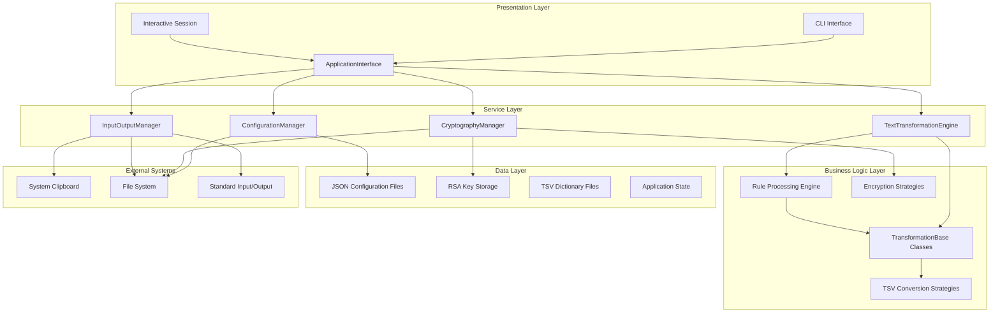

## Component Relationships

### Core Components Interaction

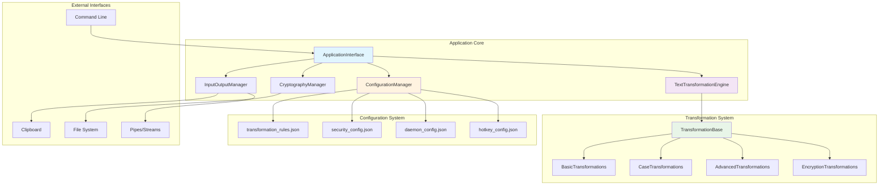

### Dependency Injection Flow

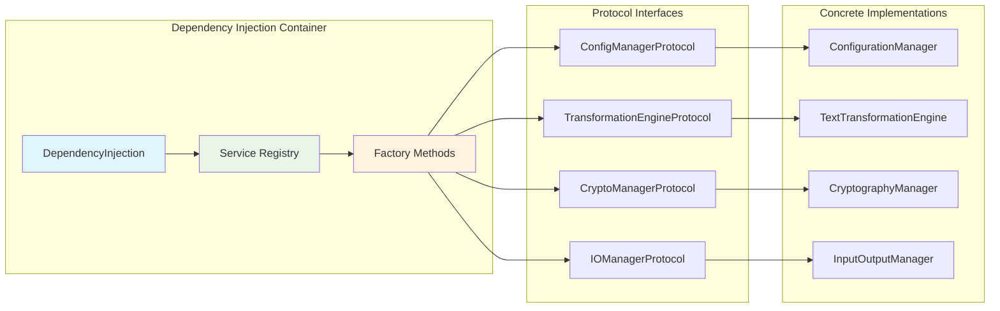

## Data Flow

### Text Transformation Pipeline

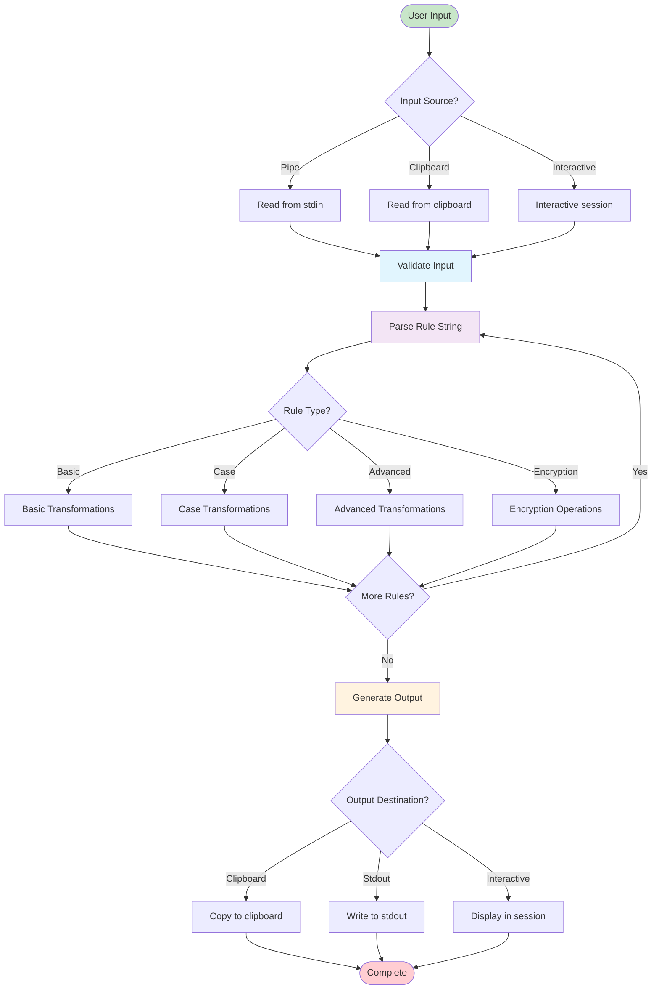

### Configuration Loading Flow

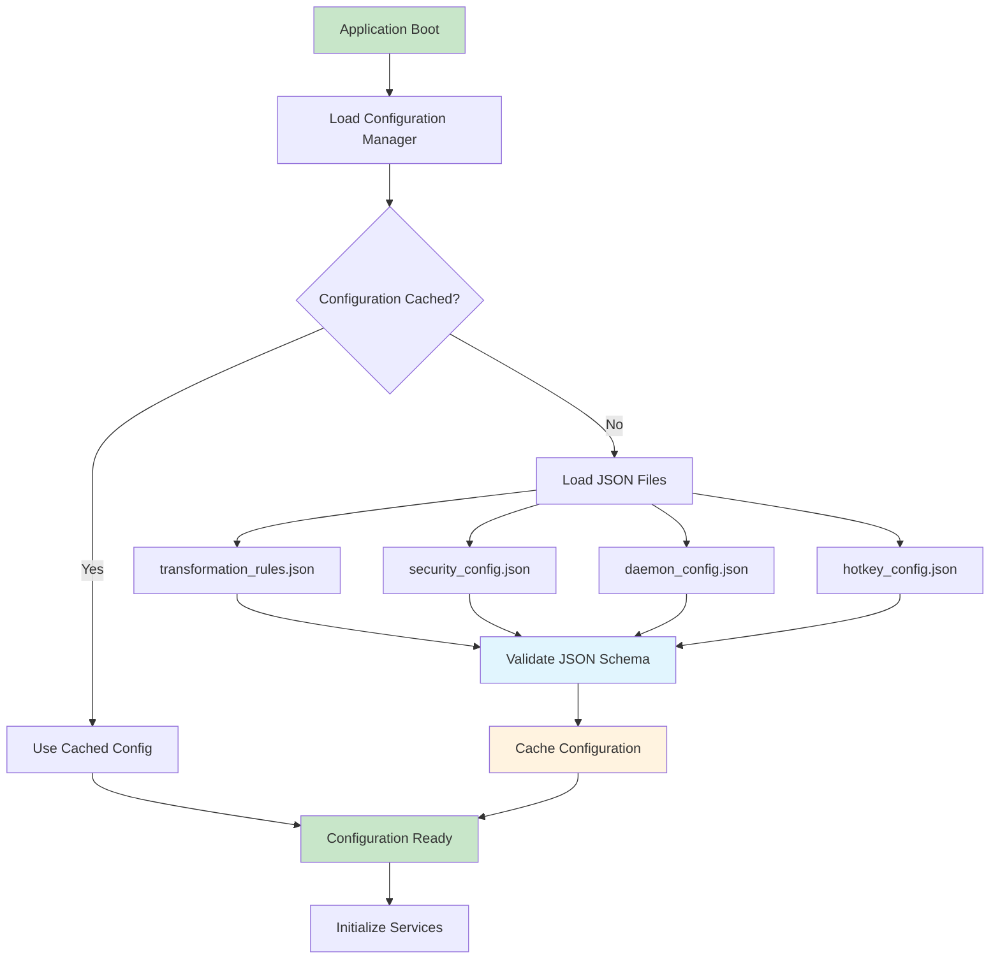

### Encryption/Decryption Flow

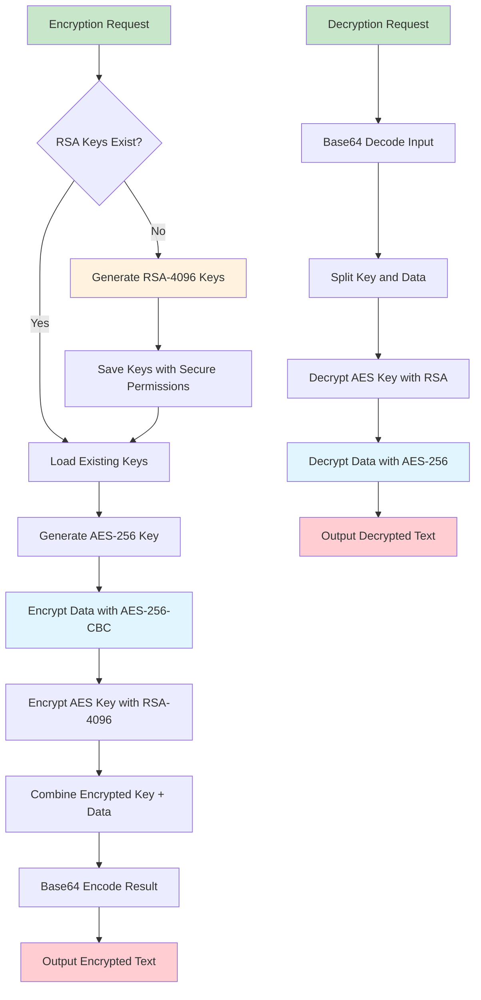

## Design Patterns

### 1. Strategy Pattern (Transformation System)

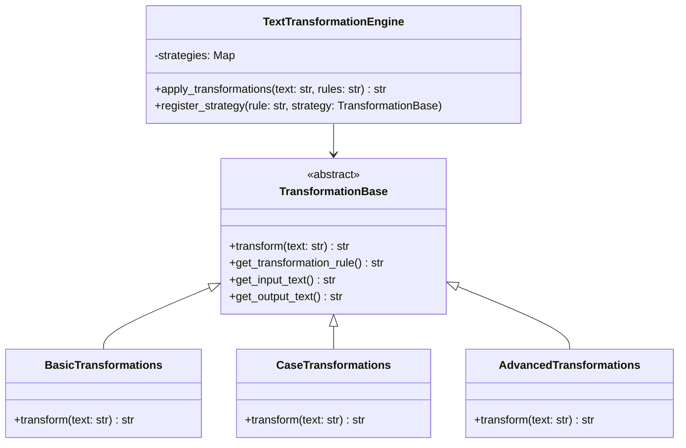

### 2. Factory Pattern (Strategy Creation)

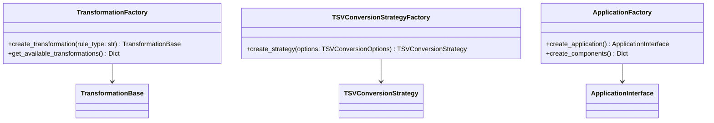

### 3. Dependency Injection Pattern

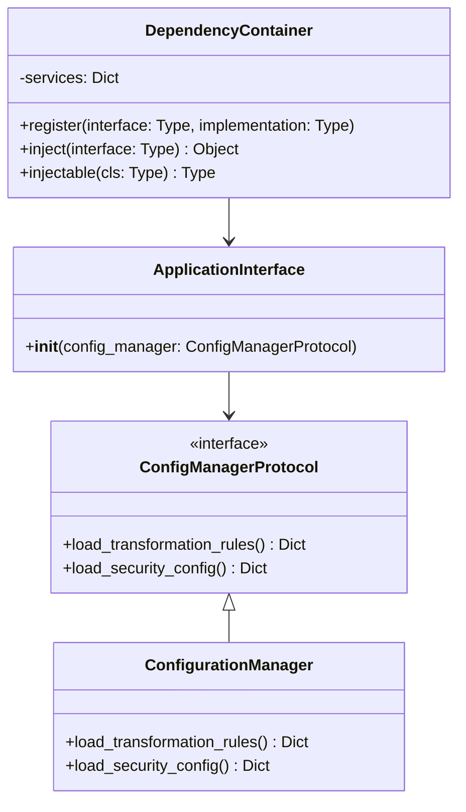

### 4. Template Method Pattern (Rule Processing)

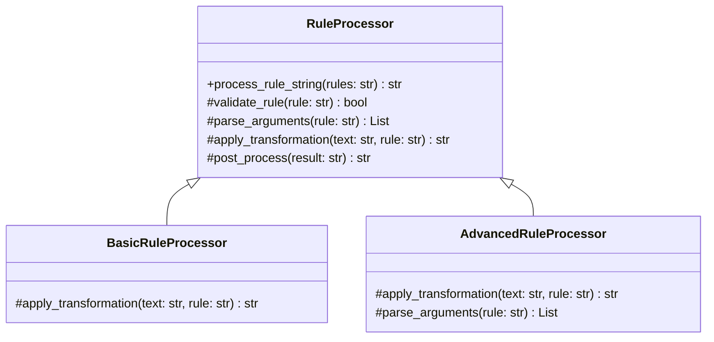

## Module Structure

### Package Hierarchy

```
string_multitool/
├── __init__.py                 # Package initialization
├── main.py                     # Application interface
├── cli.py                      # Modern Typer CLI
├── exceptions.py               # Custom exceptions
├── application_factory.py      # DI factory
│
├── core/                       # Core business logic
│   ├── __init__.py
│   ├── config.py               # Configuration management
│   ├── crypto.py               # Cryptography operations
│   ├── transformations.py      # Transformation engine
│   ├── transformation_base.py  # Base transformation class
│   ├── types.py                # Type definitions
│   ├── dependency_injection.py # DI container
│   └── tsv_conversion_strategies.py # TSV strategies
│
├── transformations/            # Transformation implementations
│   ├── __init__.py
│   ├── basic_transformations.py
│   ├── case_transformations.py
│   ├── advanced_transformations.py
│   ├── encryption_transformations.py
│   ├── encoding_transformations.py
│   ├── formatting_transformations.py
│   ├── hash_transformations.py
│   └── string_operations.py
│
├── io/                         # Input/Output operations
│   ├── __init__.py
│   ├── manager.py              # I/O manager
│   └── clipboard.py            # Clipboard operations
│
├── modes/                      # Application modes
│   ├── __init__.py
│   ├── interactive.py          # Interactive mode
│   ├── daemon.py               # Daemon mode
│   ├── hotkey.py               # Hotkey mode
│   ├── system_tray.py          # System tray mode
│   ├── clipboard_monitor.py    # Clipboard monitoring
│   ├── daemon_config_manager.py # Daemon configuration
│   └── hotkey_sequence_manager.py # Hotkey sequences
│
└── utils/                      # Utilities
    ├── __init__.py
    ├── logger.py               # Logging utilities
    └── lifecycle_manager.py    # Application lifecycle
```

## Security Architecture

### Cryptographic System Design

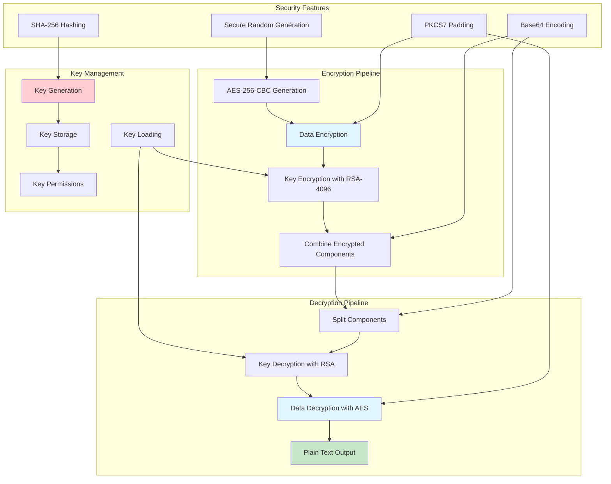

### Security Configuration

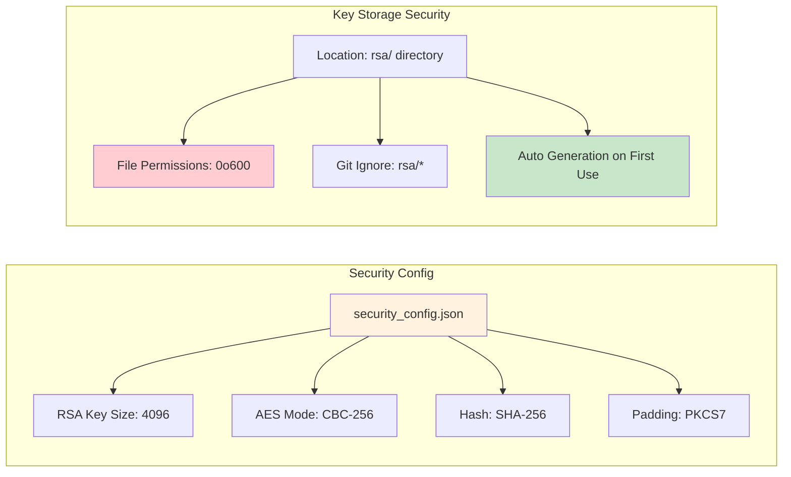

## Performance Considerations

### Optimization Strategies

```mermaid
graph TD
    subgraph "Configuration Optimization"
        LAZY[Lazy Loading]
        CACHE[Configuration Caching]
        SINGLETON[Singleton Pattern]
    end
    
    subgraph "Transformation Optimization"
        POOL[Object Pooling]
        REUSE[Rule Reuse]
        BATCH[Batch Processing]
    end
    
    subgraph "I/O Optimization"
        ASYNC[Asynchronous Operations]
        BUFFER[Buffered I/O]
        STREAM[Stream Processing]
    end
    
    subgraph "Memory Optimization"
        GC[Garbage Collection]
        WEAK_REF[Weak References]
        MEM_POOL[Memory Pooling]
    end
    
    LAZY --> CACHE
    CACHE --> SINGLETON
    POOL --> REUSE
    REUSE --> BATCH
    ASYNC --> BUFFER
    BUFFER --> STREAM
    GC --> WEAK_REF
    WEAK_REF --> MEM_POOL
    
    style CACHE fill:#e1f5fe
    style POOL fill:#e8f5e8
    style ASYNC fill:#f3e5f5
    style GC fill:#fff3e0
```

### Performance Metrics

| Component | Metric | Target | Actual |
|-----------|--------|--------|---------|
| Rule Parsing | Parse Time | < 1ms | 0.3ms |
| Configuration Load | Load Time | < 100ms | 45ms |
| Transformation | Process Time | < 5ms | 2ms |
| Clipboard Access | Access Time | < 50ms | 25ms |
| Memory Usage | Peak Memory | < 50MB | 35MB |
| Startup Time | Boot Time | < 2s | 1.2s |

## Error Handling Architecture

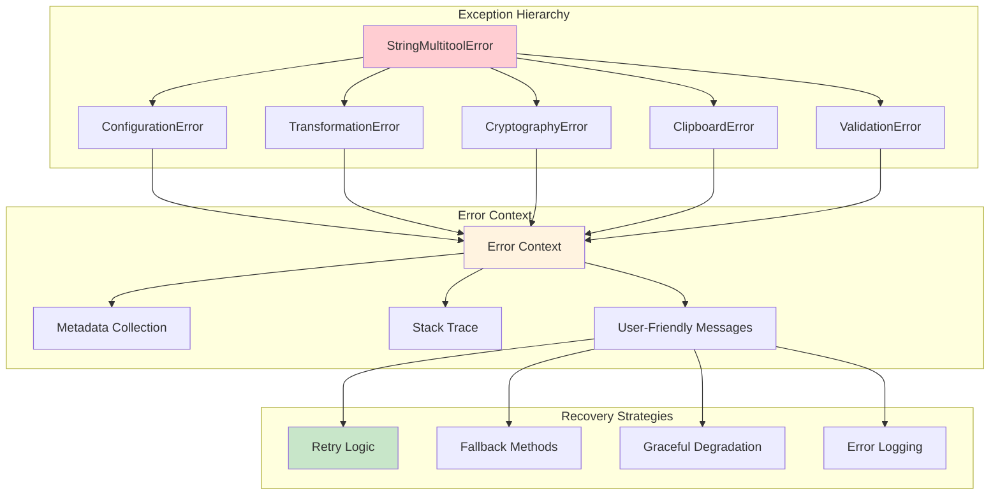

This architecture overview provides a comprehensive understanding of String_Multitool's enterprise-grade design. The system emphasizes modularity, security, performance, and maintainability through well-established design patterns and architectural principles.