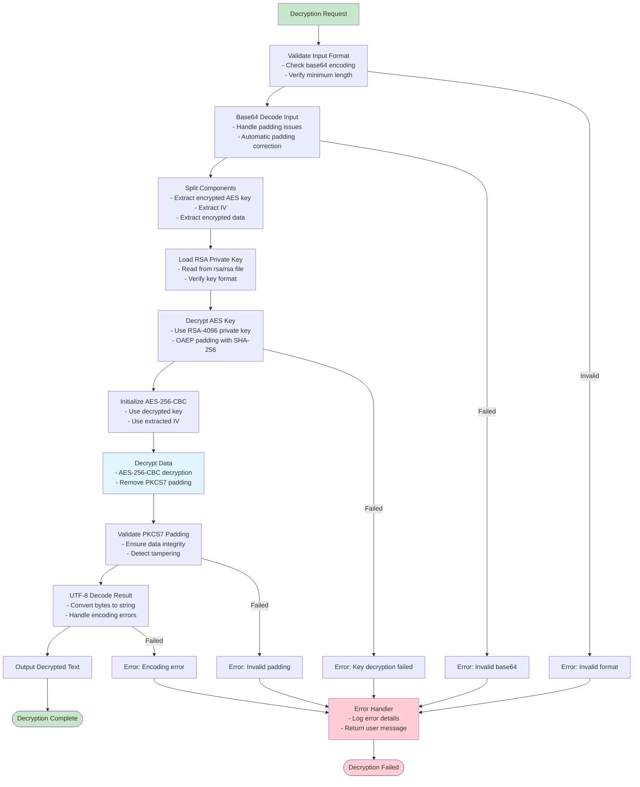
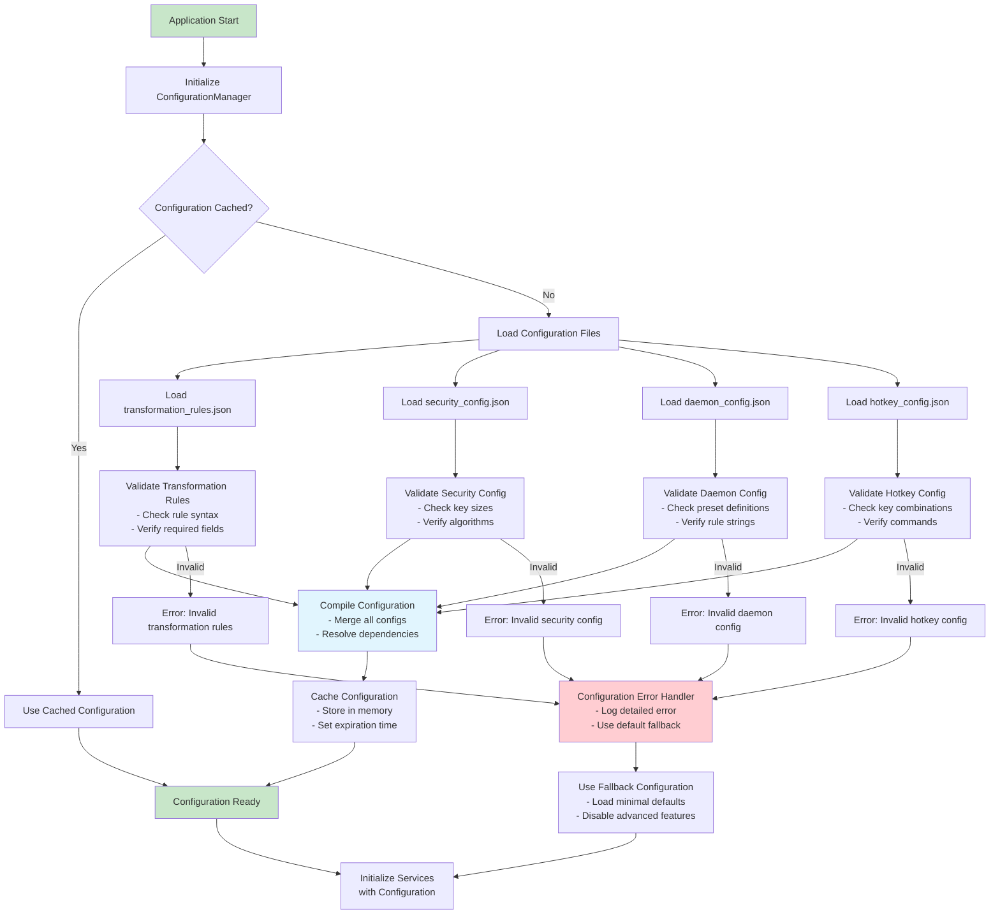
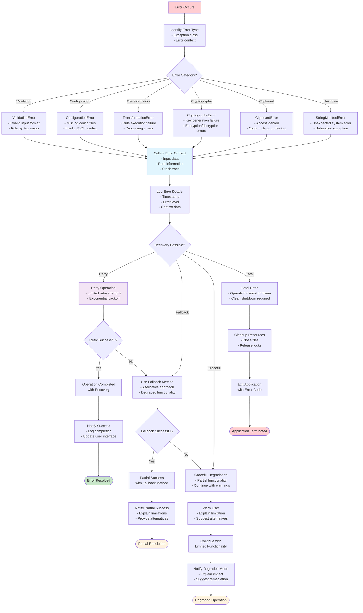

# Data Flow Diagrams

This document provides comprehensive data flow diagrams for all major String_Multitool operations, showing how data moves through the system components.

## Table of Contents

- [Text Transformation Flow](#text-transformation-flow)
- [Interactive Mode Flow](#interactive-mode-flow)
- [Daemon Mode Flow](#daemon-mode-flow)
- [Encryption/Decryption Flow](#encryptiondecryption-flow)
- [TSV Conversion Flow](#tsv-conversion-flow)
- [Configuration Loading Flow](#configuration-loading-flow)
- [Error Handling Flow](#error-handling-flow)

## Text Transformation Flow

### Basic Text Transformation Pipeline

```mermaid
flowchart TD
    START([User Command]) --> INPUT_SOURCE{Input Source?}
    
    %% Input Sources
    INPUT_SOURCE -->|Pipe| READ_STDIN[Read from stdin<br/>with UTF-8 handling]
    INPUT_SOURCE -->|Clipboard| READ_CLIP[Read from clipboard<br/>with fallback methods]
    INPUT_SOURCE -->|Interactive| GET_CURRENT[Get current session text]
    
    %% Input Validation
    READ_STDIN --> VALIDATE_INPUT[Validate Input Text<br/>- Check encoding<br/>- Handle special characters]
    READ_CLIP --> VALIDATE_INPUT
    GET_CURRENT --> VALIDATE_INPUT
    
    %% Rule Processing
    VALIDATE_INPUT --> PARSE_RULES[Parse Rule String<br/>- Split by '/'<br/>- Extract arguments]
    PARSE_RULES --> VALIDATE_RULES{Valid Rules?}
    
    VALIDATE_RULES -->|No| ERROR_INVALID[ValidationError:<br/>Invalid rule format]
    VALIDATE_RULES -->|Yes| INIT_ENGINE[Initialize<br/>TextTransformationEngine]
    
    %% Transformation Execution
    INIT_ENGINE --> RULE_LOOP[For Each Rule in Sequence]
    RULE_LOOP --> GET_TRANSFORMATION[Get Transformation Class<br/>from Factory Pattern]
    
    GET_TRANSFORMATION --> TRANSFORM[Apply Transformation<br/>- Execute transform() method<br/>- Handle errors gracefully]
    
    TRANSFORM --> MORE_RULES{More Rules?}
    MORE_RULES -->|Yes| RULE_LOOP
    MORE_RULES -->|No| OUTPUT_RESULT[Generate Final Result]
    
    %% Output Handling
    OUTPUT_RESULT --> OUTPUT_DEST{Output Destination?}
    OUTPUT_DEST -->|Clipboard| COPY_CLIP[Copy to clipboard<br/>with multiple fallback methods]
    OUTPUT_DEST -->|Stdout| WRITE_STDOUT[Write to stdout<br/>with proper encoding]
    OUTPUT_DEST -->|Interactive| UPDATE_SESSION[Update session state<br/>and display result]
    
    %% Completion
    COPY_CLIP --> LOG_SUCCESS[Log successful operation]
    WRITE_STDOUT --> LOG_SUCCESS
    UPDATE_SESSION --> LOG_SUCCESS
    LOG_SUCCESS --> END([Operation Complete])
    
    %% Error Handling
    ERROR_INVALID --> ERROR_HANDLER[Error Handler<br/>- Log error<br/>- Return user-friendly message]
    ERROR_HANDLER --> END_ERROR([Operation Failed])
    
    %% Styling
    style START fill:#c8e6c9
    style END fill:#c8e6c9
    style END_ERROR fill:#ffcdd2
    style VALIDATE_INPUT fill:#e1f5fe
    style TRANSFORM fill:#f3e5f5
    style ERROR_INVALID fill:#ffcdd2
```

### Rule Chain Processing Detail

```mermaid
flowchart TD
    RULE_STRING[Rule String: "/t/l/s"] --> SPLIT[Split by '/']
    SPLIT --> RULES_ARRAY["['t', 'l', 's']"]
    
    RULES_ARRAY --> RULE1[Rule 1: 't' - Trim]
    RULE1 --> APPLY1[Apply TrimTransformation]
    APPLY1 --> TEXT1["'hello world'"]
    
    TEXT1 --> RULE2[Rule 2: 'l' - Lowercase]
    RULE2 --> APPLY2[Apply LowercaseTransformation]
    APPLY2 --> TEXT2["'hello world'"]
    
    TEXT2 --> RULE3[Rule 3: 's' - Snake Case]
    RULE3 --> APPLY3[Apply SnakeCaseTransformation]
    APPLY3 --> FINAL["'hello_world'"]
    
    FINAL --> RESULT[Final Result]
    
    style RULE_STRING fill:#fff3e0
    style FINAL fill:#c8e6c9
    style RESULT fill:#c8e6c9
```

## Interactive Mode Flow

### Interactive Session Lifecycle

```mermaid
flowchart TD
    START_INTERACTIVE[Start Interactive Mode] --> INIT_SESSION[Initialize InteractiveSession]
    INIT_SESSION --> GET_INITIAL[Get Initial Text<br/>from clipboard]
    
    GET_INITIAL --> DISPLAY_HEADER[Display Session Header<br/>- Show current text preview<br/>- Display auto-detection status]
    
    DISPLAY_HEADER --> START_MONITORING[Start Clipboard Monitoring<br/>Background thread]
    START_MONITORING --> INPUT_LOOP[Input Loop: Wait for User Input]
    
    %% User Input Processing
    INPUT_LOOP --> PARSE_INPUT{Parse User Input}
    
    %% Command Processing
    PARSE_INPUT -->|Command| CHECK_COMMAND{Command Type?}
    CHECK_COMMAND -->|refresh| REFRESH_CLIPBOARD[Refresh from Clipboard<br/>- Get latest clipboard content<br/>- Update session state]
    CHECK_COMMAND -->|status| SHOW_STATUS[Show Session Status<br/>- Text source<br/>- Character count<br/>- Auto-detection state]
    CHECK_COMMAND -->|copy| COPY_RESULT[Copy Current Text to Clipboard]
    CHECK_COMMAND -->|clear| CLEAR_TEXT[Clear Current Working Text]
    CHECK_COMMAND -->|help| SHOW_HELP[Display Available Rules]
    CHECK_COMMAND -->|daemon| SWITCH_DAEMON[Switch to Daemon Mode<br/>- Cleanup interactive session<br/>- Initialize daemon mode]
    CHECK_COMMAND -->|quit| CLEANUP[Cleanup Session<br/>- Stop monitoring<br/>- Save session statistics]
    
    %% Transformation Processing
    PARSE_INPUT -->|Rule| APPLY_TRANSFORM[Apply Transformation Rules<br/>- Use current session text<br/>- Apply rule chain]
    APPLY_TRANSFORM --> UPDATE_RESULT[Update Result<br/>- Copy to clipboard<br/>- Display result preview]
    
    %% Auto-detection Processing
    BACKGROUND_MONITOR[Background: Clipboard Monitor] --> DETECT_CHANGE{Clipboard Changed?}
    DETECT_CHANGE -->|Yes| NOTIFY_CHANGE[Display Notification<br/>"🔔 Clipboard changed!"]
    DETECT_CHANGE -->|No| CONTINUE_MONITOR[Continue Monitoring]
    NOTIFY_CHANGE --> CONTINUE_MONITOR
    CONTINUE_MONITOR --> BACKGROUND_MONITOR
    
    %% Return to Input Loop
    REFRESH_CLIPBOARD --> INPUT_LOOP
    SHOW_STATUS --> INPUT_LOOP
    COPY_RESULT --> INPUT_LOOP
    CLEAR_TEXT --> INPUT_LOOP
    SHOW_HELP --> INPUT_LOOP
    UPDATE_RESULT --> INPUT_LOOP
    
    %% Exit Conditions
    SWITCH_DAEMON --> END_INTERACTIVE[End Interactive Mode]
    CLEANUP --> END_INTERACTIVE
    
    END_INTERACTIVE --> END([Interactive Mode Complete])
    
    %% Styling
    style START_INTERACTIVE fill:#c8e6c9
    style END fill:#c8e6c9
    style BACKGROUND_MONITOR fill:#e1f5fe
    style DETECT_CHANGE fill:#f3e5f5
    style APPLY_TRANSFORM fill:#fff3e0
```

### Auto-detection System Flow

```mermaid
flowchart TD
    INIT_AUTO[Initialize Auto-Detection] --> START_THREAD[Start Background Thread]
    START_THREAD --> INITIAL_CONTENT[Store Initial Clipboard Content]
    
    INITIAL_CONTENT --> MONITOR_LOOP[Monitoring Loop<br/>Check every 1 second]
    
    MONITOR_LOOP --> GET_CURRENT[Get Current Clipboard Content]
    GET_CURRENT --> COMPARE{Content Changed?}
    
    COMPARE -->|No| SLEEP[Sleep 1 second]
    COMPARE -->|Yes| PREPARE_NOTIFICATION[Prepare Change Notification]
    
    PREPARE_NOTIFICATION --> CALC_LENGTH[Calculate Content Length]
    CALC_LENGTH --> PREVIEW[Generate Content Preview<br/>First 100 characters]
    PREVIEW --> DISPLAY_NOTIFICATION[Display Notification:<br/>"🔔 Clipboard changed! New content available"]
    
    DISPLAY_NOTIFICATION --> UPDATE_STORED[Update Stored Content]
    UPDATE_STORED --> SLEEP
    
    SLEEP --> MONITOR_LOOP
    
    %% User Interaction
    USER_REFRESH[User Types 'refresh'] --> LOAD_NEW[Load New Clipboard Content]
    LOAD_NEW --> UPDATE_SESSION[Update Session with New Content]
    UPDATE_SESSION --> CONFIRM_LOAD[Display: "Loaded new content"]
    
    style INIT_AUTO fill:#c8e6c9
    style MONITOR_LOOP fill:#e1f5fe
    style DISPLAY_NOTIFICATION fill:#fff3e0
    style USER_REFRESH fill:#f3e5f5
```

## Daemon Mode Flow

### Daemon Mode Operation

```mermaid
flowchart TD
    START_DAEMON[Start Daemon Mode] --> INIT_DAEMON[Initialize DaemonMode]
    INIT_DAEMON --> LOAD_CONFIG[Load Daemon Configuration<br/>- Load presets<br/>- Load default rules]
    
    LOAD_CONFIG --> SHOW_PRESETS[Display Available Presets<br/>- List numbered presets<br/>- Show descriptions]
    
    SHOW_PRESETS --> COMMAND_LOOP[Command Loop: Wait for User Input]
    
    %% Command Processing
    COMMAND_LOOP --> PARSE_COMMAND{Parse Command}
    
    %% Preset Selection
    PARSE_COMMAND -->|preset N| SET_PRESET[Set Transformation Preset<br/>- Load preset rules<br/>- Validate rules]
    
    %% Custom Rules
    PARSE_COMMAND -->|rules /x/y| SET_CUSTOM[Set Custom Rules<br/>- Parse rule string<br/>- Validate syntax]
    
    %% Direct Rule (Shortcut)
    PARSE_COMMAND -->|/rule| SET_DIRECT[Set Rule Directly<br/>- Shortcut syntax<br/>- Immediate rule setting]
    
    %% Monitoring Control
    PARSE_COMMAND -->|start| START_MONITORING{Rules Set?}
    START_MONITORING -->|No| ERROR_NO_RULES[Error: No rules configured]
    START_MONITORING -->|Yes| BEGIN_MONITOR[Begin Clipboard Monitoring<br/>- Start background thread<br/>- Apply automatic transformations]
    
    PARSE_COMMAND -->|stop| STOP_MONITORING[Stop Clipboard Monitoring<br/>- Stop background thread<br/>- Display statistics]
    
    %% Status and Information
    PARSE_COMMAND -->|status| SHOW_DAEMON_STATUS[Show Daemon Status<br/>- Running state<br/>- Active rules<br/>- Statistics]
    
    %% Mode Switching
    PARSE_COMMAND -->|interactive| SWITCH_INTERACTIVE[Switch to Interactive Mode<br/>- Stop monitoring<br/>- Initialize interactive session]
    
    PARSE_COMMAND -->|quit| STOP_DAEMON[Stop Daemon<br/>- Cleanup resources<br/>- Display final statistics]
    
    %% Background Monitoring Process
    BEGIN_MONITOR --> MONITOR_CLIPBOARD[Monitor Clipboard Changes]
    MONITOR_CLIPBOARD --> CLIP_CHANGED{Clipboard Changed?}
    
    CLIP_CHANGED -->|No| CONTINUE_MONITORING[Continue Monitoring]
    CLIP_CHANGED -->|Yes| GET_CLIP_CONTENT[Get Clipboard Content]
    
    GET_CLIP_CONTENT --> APPLY_DAEMON_RULES[Apply Active Rules<br/>- Execute rule chain<br/>- Handle errors gracefully]
    
    APPLY_DAEMON_RULES --> UPDATE_CLIPBOARD[Update Clipboard with Result]
    UPDATE_CLIPBOARD --> LOG_TRANSFORMATION[Log Transformation<br/>- Increment counters<br/>- Record success/failure]
    
    LOG_TRANSFORMATION --> DISPLAY_RESULT[Display Transformation Result<br/>"[DAEMON] Transformed: 'old' -> 'new'"]
    DISPLAY_RESULT --> CONTINUE_MONITORING
    
    CONTINUE_MONITORING --> MONITOR_CLIPBOARD
    
    %% Return to Command Loop
    SET_PRESET --> COMMAND_LOOP
    SET_CUSTOM --> COMMAND_LOOP
    SET_DIRECT --> COMMAND_LOOP
    ERROR_NO_RULES --> COMMAND_LOOP
    STOP_MONITORING --> COMMAND_LOOP
    SHOW_DAEMON_STATUS --> COMMAND_LOOP
    
    %% Exit Conditions
    SWITCH_INTERACTIVE --> END_DAEMON[End Daemon Mode]
    STOP_DAEMON --> END_DAEMON
    END_DAEMON --> END([Daemon Mode Complete])
    
    %% Styling
    style START_DAEMON fill:#c8e6c9
    style END fill:#c8e6c9
    style BEGIN_MONITOR fill:#e1f5fe
    style APPLY_DAEMON_RULES fill:#f3e5f5
    style ERROR_NO_RULES fill:#ffcdd2
```

## Encryption/Decryption Flow

### RSA Encryption Process

```mermaid
flowchart TD
    START_ENC[Encryption Request] --> CHECK_KEYS{RSA Keys Exist?}
    
    %% Key Generation Path
    CHECK_KEYS -->|No| GEN_PRIVATE[Generate RSA-4096 Private Key<br/>- Use secure random generator<br/>- OAEP padding with SHA-256]
    GEN_PRIVATE --> GEN_PUBLIC[Generate RSA-4096 Public Key<br/>- Derive from private key]
    GEN_PUBLIC --> SAVE_PRIVATE[Save Private Key<br/>- PEM format<br/>- File permissions: 0o600]
    SAVE_PRIVATE --> SAVE_PUBLIC[Save Public Key<br/>- PEM format<br/>- Public access permissions]
    SAVE_PUBLIC --> LOAD_KEYS[Load Keys into Memory]
    
    %% Key Loading Path
    CHECK_KEYS -->|Yes| LOAD_KEYS
    
    %% Encryption Process
    LOAD_KEYS --> GEN_AES_KEY[Generate AES-256 Key<br/>- Cryptographically secure random<br/>- 32 bytes for AES-256]
    GEN_AES_KEY --> GEN_IV[Generate IV<br/>- 16 bytes for AES-CBC<br/>- Secure random]
    
    GEN_IV --> ENCRYPT_DATA[Encrypt Data with AES-256-CBC<br/>- Apply PKCS7 padding<br/>- Use generated IV]
    ENCRYPT_DATA --> ENCRYPT_AES_KEY[Encrypt AES Key with RSA-4096<br/>- OAEP padding<br/>- SHA-256 hash]
    
    ENCRYPT_AES_KEY --> COMBINE_COMPONENTS[Combine Components<br/>- Encrypted AES key<br/>- IV<br/>- Encrypted data]
    
    COMBINE_COMPONENTS --> BASE64_ENCODE[Base64 Encode Result<br/>- Safe text representation<br/>- Automatic padding correction]
    
    BASE64_ENCODE --> OUTPUT_ENCRYPTED[Output Encrypted Text]
    OUTPUT_ENCRYPTED --> END_ENC([Encryption Complete])
    
    style START_ENC fill:#c8e6c9
    style END_ENC fill:#c8e6c9
    style GEN_PRIVATE fill:#fff3e0
    style ENCRYPT_DATA fill:#e1f5fe
    style BASE64_ENCODE fill:#f3e5f5
```



### RSA Decryption Process



## TSV Conversion Flow

### TSV-Based Text Conversion

```mermaid
flowchart TD
    START_TSV[TSV Conversion Request] --> PARSE_ARGS[Parse Arguments<br/>- Extract TSV file path<br/>- Parse options (case-insensitive, etc.)]
    
    PARSE_ARGS --> VALIDATE_FILE{TSV File Exists?}
    VALIDATE_FILE -->|No| ERROR_FILE[Error: TSV file not found]
    VALIDATE_FILE -->|Yes| LOAD_TSV[Load TSV File<br/>- Read with UTF-8 encoding<br/>- Handle BOM if present]
    
    LOAD_TSV --> PARSE_TSV[Parse TSV Content<br/>- Split lines<br/>- Parse tab-separated values<br/>- Skip empty lines]
    
    PARSE_TSV --> CREATE_DICT[Create Conversion Dictionary<br/>- Key: source text<br/>- Value: replacement text<br/>- Handle duplicates]
    
    CREATE_DICT --> SELECT_STRATEGY[Select Conversion Strategy<br/>Based on options]
    
    SELECT_STRATEGY --> STRATEGY_TYPE{Strategy Type?}
    
    %% Case-Sensitive Strategy
    STRATEGY_TYPE -->|Case Sensitive| EXACT_MATCH[Exact Match Strategy<br/>- Direct dictionary lookup<br/>- Preserve original case]
    
    %% Case-Insensitive Strategy
    STRATEGY_TYPE -->|Case Insensitive| CASE_INSENSITIVE[Case-Insensitive Strategy<br/>- Normalize keys to lowercase<br/>- Smart case preservation]
    
    %% Apply Conversion
    EXACT_MATCH --> APPLY_CONVERSION[Apply Text Conversion]
    CASE_INSENSITIVE --> APPLY_CONVERSION
    
    APPLY_CONVERSION --> FIND_MATCHES[Find All Matches<br/>- Longest match priority<br/>- Non-overlapping replacement]
    
    FIND_MATCHES --> REPLACE_TEXT[Replace Matched Text<br/>- Apply case preservation rules<br/>- Maintain text integrity]
    
    REPLACE_TEXT --> VALIDATE_RESULT[Validate Result<br/>- Check for encoding issues<br/>- Verify no data loss]
    
    VALIDATE_RESULT --> OUTPUT_TSV[Output Converted Text]
    OUTPUT_TSV --> END_TSV([TSV Conversion Complete])
    
    %% Error Handling
    ERROR_FILE --> ERROR_TSV_HANDLER[TSV Error Handler]
    PARSE_TSV -->|Parse Error| ERROR_FORMAT_TSV[Error: Invalid TSV format]
    ERROR_FORMAT_TSV --> ERROR_TSV_HANDLER
    
    ERROR_TSV_HANDLER --> END_TSV_ERROR([TSV Conversion Failed])
    
    style START_TSV fill:#c8e6c9
    style END_TSV fill:#c8e6c9
    style END_TSV_ERROR fill:#ffcdd2
    style SELECT_STRATEGY fill:#fff3e0
    style APPLY_CONVERSION fill:#e1f5fe
```

### Case-Insensitive Conversion Strategy

```mermaid
flowchart TD
    INPUT_TEXT[Input Text: "Use API and sql"] --> TOKENIZE[Tokenize Text<br/>Split into words and separators]
    
    TOKENIZE --> TOKEN_LOOP[For Each Token]
    TOKEN_LOOP --> CHECK_DICT{Token in Dictionary?}
    
    CHECK_DICT -->|No| KEEP_TOKEN[Keep Original Token]
    CHECK_DICT -->|Yes| GET_REPLACEMENT[Get Replacement from Dictionary]
    
    GET_REPLACEMENT --> ANALYZE_CASE[Analyze Original Case Pattern<br/>- ALL_UPPER: "API"<br/>- Title_Case: "Sql"<br/>- lower_case: "api"]
    
    ANALYZE_CASE --> APPLY_PATTERN[Apply Case Pattern to Replacement<br/>- Preserve original case structure]
    
    APPLY_PATTERN --> CASE_TYPE{Original Case Type?}
    CASE_TYPE -->|ALL_UPPER| UPPER_RESULT["APPLICATION PROGRAMMING INTERFACE"]
    CASE_TYPE -->|Title_Case| TITLE_RESULT["Structured Query Language"] 
    CASE_TYPE -->|lower_case| LOWER_RESULT["application programming interface"]
    
    UPPER_RESULT --> COLLECT_RESULT[Collect Converted Token]
    TITLE_RESULT --> COLLECT_RESULT
    LOWER_RESULT --> COLLECT_RESULT
    KEEP_TOKEN --> COLLECT_RESULT
    
    COLLECT_RESULT --> MORE_TOKENS{More Tokens?}
    MORE_TOKENS -->|Yes| TOKEN_LOOP
    MORE_TOKENS -->|No| COMBINE_RESULT[Combine All Tokens<br/>Reconstruct original structure]
    
    COMBINE_RESULT --> FINAL_OUTPUT["Use APPLICATION PROGRAMMING INTERFACE and Structured Query Language"]
    
    style INPUT_TEXT fill:#c8e6c9
    style FINAL_OUTPUT fill:#c8e6c9
    style ANALYZE_CASE fill:#e1f5fe
    style APPLY_PATTERN fill:#f3e5f5
```

## Configuration Loading Flow

### Configuration Management System



## Error Handling Flow

### Comprehensive Error Processing



These data flow diagrams provide a comprehensive view of how data moves through String_Multitool's various operations. Each diagram shows the detailed steps, decision points, error handling, and recovery mechanisms that ensure robust and reliable operation across all system components.