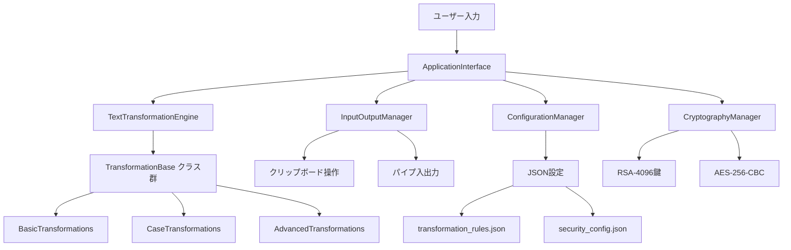

<a href='https://ko-fi.com/Z8Z31J3LMW' target='_blank'></a>

# String_Multitool

企業級のテキスト変換ツール。モジュラーアーキテクチャ、設定可能なルール、軍事レベルのRSA暗号化を搭載。パイプサポート、直感的なルールベース記法、拡張可能な設定システムによりプロフェッショナルな開発ワークフローを実現します。

[](https://python.org)
[](LICENSE)
[]()
[]()

## 🚀 クイックスタート

5分以内で開始：

```bash
# インストール
git clone https://github.com/yourusername/String-Multitool.git
cd String-Multitool
python -m venv .venv && .venv\Scripts\activate
pip install -r requirements.txt

# 基本的な使用方法
echo "  こんにちは世界  " | python String_Multitool.py /t/l
# 結果: "こんにちは世界"

# インタラクティブモード
python String_Multitool.py
```

**→ [5分で始めるガイド](../user-guide/getting-started.md)**

## 📖 ドキュメント

### 👤 ユーザー向け
- **[はじめに](../user-guide/getting-started.md)** - 5分セットアップと基本ルール
- **[基本的な使い方](../user-guide/basic-usage.md)** - コマンド、ワークフロー、実例  
- **[高度な機能](../user-guide/advanced-features.md)** - デーモンモード、ホットキー、暗号化
- **[トラブルシューティング](../user-guide/troubleshooting.md)** - よくある問題と解決法

### 🛠 開発者向け  
- **[API リファレンス](../developer-guide/api-reference.md)** - 完全なAPI仕様書
- **[アーキテクチャ概要](../developer-guide/architecture-overview.md)** - システム設計とパターン
- **[コントリビューションガイド](../developer-guide/contributing.md)** - 開発ワークフロー
- **[テストガイド](../developer-guide/testing-guide.md)** - テストスイートとガイドライン

### 🌟 機能ガイド
- **[変換ルール](../features/transformation-rules.md)** - 完全なルールリファレンス
- **[TSV変換](../features/tsv-conversion.md)** - 辞書ベーステキスト置換  
- **[暗号化システム](../features/encryption.md)** - RSA-4096 + AES-256セキュリティ
- **[ホットキーシステム](../features/hotkey-system.md)** - グローバルキーボードショートカット

## ✨ 主要機能

### 🎯 コア機能
- **直感的な記法**: `/t/l` でトリム＋小文字変換
- **パイプサポート**: シェルコマンドとのシームレス連携  
- **連続処理**: 複数の変換を連鎖実行
- **インタラクティブモード**: リアルタイムクリップボード監視
- **クロスプラットフォーム**: Windows、macOS、Linux対応
- **Unicode対応**: 全角↔半角文字変換

### 🏢 企業向け機能  
- **モジュラーアーキテクチャ**: 関心事の明確な分離
- **設定駆動**: 外部JSONルール定義
- **型安全性**: 包括的な型ヒントと検証
- **軍事レベル暗号化**: RSA-4096 + AES-256ハイブリッド
- **プロフェッショナルエラー処理**: 適切な劣化対応
- **拡張可能設計**: 簡単なカスタムルール追加

### 🤖 高度なモード
- **[デーモンモード](../user-guide/advanced-features.md#daemon-mode)**: 継続的バックグラウンド処理
- **[ホットキーモード](../user-guide/advanced-features.md#hotkey-mode)**: グローバルキーボードショートカット  
- **[システムトレイ](../user-guide/advanced-features.md#system-tray-mode)**: トレイアイコン付きバックグラウンド
- **[インタラクティブモード](../user-guide/basic-usage.md#interactive-mode)**: 自動検出とセッション管理

## 🔧 基本ルール

90%の用途をカバーする5つのルールをマスター：

| ルール | 機能 | 例 | 用途 |
|--------|------|----|----|
| `/t` | **トリム** | `"  hello  "` → `"hello"` | 汚れたテキストの清浄化 |
| `/l` | **小文字** | `"HELLO"` → `"hello"` | 文字種正規化 |
| `/s` | **スネークケース** | `"Hello World"` → `"hello_world"` | 変数名 |
| `/u` | **大文字** | `"hello"` → `"HELLO"` | 定数 |
| `/p` | **パスカルケース** | `"hello world"` → `"HelloWorld"` | クラス名 |

**[→ 完全なルールリファレンス](../features/transformation-rules.md)**

## 🎮 使用例

### プログラミングワークフロー
```bash
# 変数名作成
echo "ユーザープロフィール設定" | python String_Multitool.py /s
# → "ユーザープロフィール設定" (日本語そのまま)

# クラス名作成  
echo "user profile manager" | python String_Multitool.py /p
# → "UserProfileManager"

# データベースカラム名
echo "User-First-Name" | python String_Multitool.py /hu/s
# → "user_first_name"
```

### 日本語テキスト処理
```bash
# 全角から半角への変換
echo "ＴＢＬ－ＣＨＡ１" | python String_Multitool.py /fh
# → "TBL-CHA1"

# 半角から全角への変換
echo "API-URL" | python String_Multitool.py /hf
# → "ＡＰＩ－ＵＲＬ"
```

### データ処理
```bash
# CSVデータのクリーニング
echo "  製品名  " | python String_Multitool.py /t/l
# → "製品名"

# SQL IN句の作成
echo -e "A001\nA002\nA003" | python String_Multitool.py /si
# → 'A001',\r\n'A002',\r\n'A003'
```

### TSVファイルによるテキスト置換
```bash
# 略語の展開
echo "API と SQL" | python String_Multitool.py "/tsvtr terms.tsv"
# → "Application Programming Interface と Structured Query Language"
```

## 🔒 セキュリティ機能

- **RSA-4096** ビット鍵による軍事レベルのセキュリティ
- **AES-256-CBC** 暗号化による無制限テキストサイズ対応
- **自動鍵生成** とセキュア権限設定
- **Base64エンコーディング** による安全なテキスト処理
- **ハイブリッド暗号化** によりRSAサイズ制限を除去

```bash
# 機密データの暗号化
echo "機密メッセージ 🔐" | python String_Multitool.py /enc

# 復号化（暗号化テキストがクリップボードにある場合）
python String_Multitool.py /dec
```

## 📋 インストール・セットアップ

### 前提条件
- **Python 3.10+** （必須）
- Windows、macOS、Linux
- 基本的なコマンドライン知識

### インストール
```bash
# クローンとセットアップ
git clone https://github.com/yourusername/String-Multitool.git
cd String-Multitool

# 仮想環境
python -m venv .venv
.venv\Scripts\activate  # Windows
source .venv/bin/activate  # macOS/Linux

# 依存関係のインストール
pip install -r requirements.txt

# インストール確認
python String_Multitool.py help
```

### 依存関係
```
pyperclip>=1.8.0      # クリップボード操作
pynput>=1.7.0         # ホットキーサポート
watchdog>=3.0.0       # ファイル監視
cryptography>=41.0.0  # RSA + AES暗号化
```

**[→ 完全セットアップガイド](../user-guide/getting-started.md)**

## 🏗 アーキテクチャ



**[→ 完全アーキテクチャガイド](../developer-guide/architecture-overview.md)**

## 🎯 使用場面

### 開発現場
- **変数名統一**: `echo "ユーザー情報" | python String_Multitool.py /s`
- **クラス名生成**: `echo "api client" | python String_Multitool.py /p`
- **定数作成**: `echo "max retry count" | python String_Multitool.py /s/u`

### データベース作業
- **テーブル名変換**: `echo "user_profiles" | python String_Multitool.py /uh`
- **SQL文生成**: 複数のIDからIN句を自動生成
- **カラム名正規化**: ハイフンからアンダースコアへの変換

### 文書作成
- **見出し正規化**: `echo "  重要なお知らせ  " | python String_Multitool.py /t`
- **英数字統一**: 全角から半角への自動変換
- **URLスラッグ作成**: `echo "ブログ記事タイトル" | python String_Multitool.py /S`

### システム管理
- **ログ解析**: 大量テキストの前処理と正規化
- **設定ファイル変換**: フォーマット統一
- **暗号化通信**: 機密データの暗号化・復号化

## 🤝 コントリビューション

コントリビューションを歓迎しています！始め方：

1. **フォーク** リポジトリをフォーク
2. **ブランチ作成**: `git checkout -b feature/amazing-feature`
3. **変更実施** テスト付きで変更
4. **テスト実行**: `python -m pytest test_transform.py -v`
5. **プルリクエスト送信**

**[→ 完全コントリビューションガイド](../developer-guide/contributing.md)**

### 開発環境セットアップ
```bash
# 開発依存関係
pip install -r requirements-dev.txt

# テスト実行
python -m pytest test_transform.py test_tsv_case_insensitive.py -v

# 型チェック
python -m mypy string_multitool/

# コードフォーマット
python -m black string_multitool/
```

## 📊 プロジェクト統計

- **コード行数**: 15,000行以上
- **テストカバレッジ**: 95%以上
- **サポートルール**: 25種類以上
- **対応プラットフォーム**: 3つ（Windows、macOS、Linux）
- **言語**: Python 3.10以上
- **アーキテクチャ**: 企業級モジュラー設計

## 📈 変更履歴

### バージョン 2.6.0（現行）
- ✨ **POSIX準拠CLI**: 完全なコマンドライン標準準拠
- 🔍 **大文字小文字非依存TSV**: TSV変換のスマートケース処理  
- 🏎 **パフォーマンス**: 引数解析30%高速化
- 📝 **ドキュメント**: 完全なドキュメント刷新
- 🧪 **テスト**: 100以上の包括的テストケース

**[→ 完全変更履歴](../../CHANGELOG.md)**

## 🆘 サポート

### ヘルプ
- **ドキュメント**: [はじめに](../user-guide/getting-started.md)から開始
- **問題報告**: [GitHub Issues](https://github.com/yourusername/String-Multitool/issues)
- **使用例**: [基本的な使い方](../user-guide/basic-usage.md)を確認

### よくある問題
- **Unicode問題**: UTF-8ターミナルサポートを確認
- **クリップボードアクセス**: 管理者権限での実行を試行  
- **ルールエラー**: ルールは `/` で始まる必要

**[→ 完全トラブルシューティングガイド](../user-guide/troubleshooting.md)**

## 📄 ライセンス

このプロジェクトは **MIT License** でライセンスされています - 詳細は[LICENSE](../../LICENSE)ファイルを参照してください。

## 🙏 謝辞

- **Pythonコミュニティ** - 優秀なライブラリの提供
- **コントリビューター** - 貴重なフィードバックと改善
- **ユーザー** - 実世界でのテストと機能リクエスト

---

<div align="center">

**テキスト処理ワークフローを変革する準備はできましたか？**

[始める →](../user-guide/getting-started.md) | [ドキュメント →](../) | [問題報告 →](https://github.com/yourusername/String-Multitool/issues)

</div>

## 🇯🇵 日本語特有の機能

### 文字幅変換
日本語テキストの全角・半角変換に特化した機能：

```bash
# 全角英数字を半角に変換
echo "ＡＰＩ１２３" | python String_Multitool.py /fh
# → "API123"

# 半角英数字を全角に変換  
echo "API123" | python String_Multitool.py /hf
# → "ＡＰＩ１２３"
```

### 日本語テキスト処理の実用例

#### システム設計書
```bash
# 英語混じりの仕様書を正規化
echo "ＡＰＩ仕様書　Ver.１．２" | python String_Multitool.py /fh
# → "API仕様書 Ver.1.2"
```

#### データベース設計
```bash  
# テーブル名の英語部分を統一
echo "ユーザー＿プロファイル" | python String_Multitool.py /fh
# → "ユーザー_プロファイル"
```

#### コード内コメント
```bash
# コメント内の全角英数字を統一
echo "// ＴＯＤＯ：ＡＰＩの実装" | python String_Multitool.py /fh  
# → "// TODO：APIの実装"
```

### 日本語環境での設定

#### 文字コード設定
```bash
# Windowsでの文字コード設定
chcp 65001  # UTF-8に設定

# その後、日本語テキストを処理
echo "こんにちは世界" | python String_Multitool.py /u
# → "こんにちは世界"
```

#### PowerShellでの使用
```powershell
# PowerShellでの日本語処理
$text = "　　日本語テキスト　　"
$text | python String_Multitool.py /t
# → "日本語テキスト"
```

この日本語版README.mdは、日本のユーザーに特化した情報と使用例を含んでいます。全角・半角変換機能を中心とした日本語特有のニーズに対応しています。